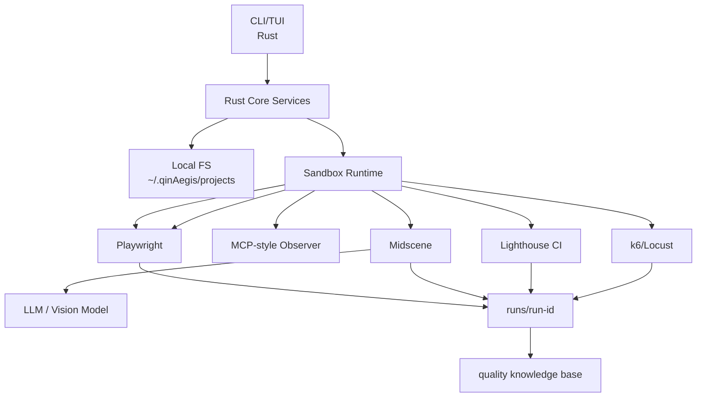
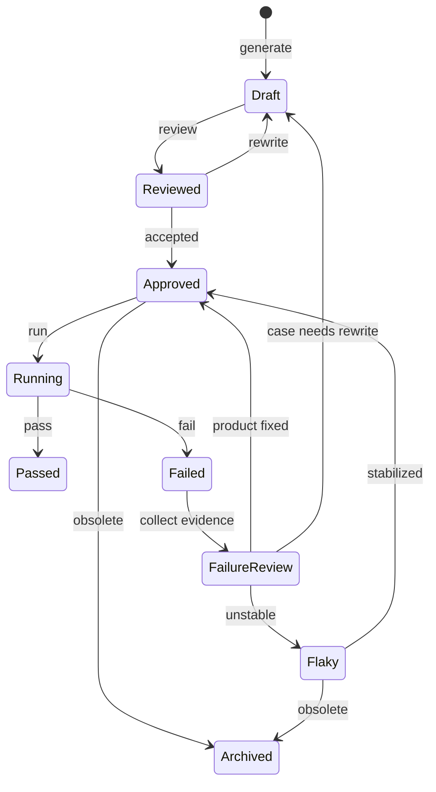

# qinAegis

Local-first AI quality engineering platform for Web applications.

qinAegis is not another browser automation SDK. It is a productized testing workbench that combines mature open-source automation tools with local test asset governance, sandbox execution, failure review, and quality gates.

## Positioning

qinAegis helps a Web team move from ad hoc test scripts to a durable local quality knowledge base:

```text
understand product -> plan tests -> generate cases -> review cases
-> run in sandbox -> collect evidence -> explain failures
-> enforce quality gates -> update project knowledge
```

Core principles:

- **Local-first**: specs, requirements, cases, runs, and knowledge live under `~/.qinAegis/projects/`.
- **No Notion core dependency**: external collaboration tools are optional integrations, not the source of truth.
- **Structured before visual**: use accessibility snapshots, DOM, console, and network signals before calling a vision model.
- **Deterministic before agentic**: approved regression cases should run with minimal LLM involvement.
- **Evidence-first**: every failure should include enough artifacts to classify it as product, test, environment, or model related.

## Technology Stack

| Layer | Technology | Role |
|---|---|---|
| CLI/TUI | Rust, clap, ratatui | Local workflow and project dashboard |
| Core services | Rust, tokio | Project, requirement, case, run, report, and gate orchestration |
| Storage | Local filesystem | Source of truth under `~/.qinAegis/projects/` |
| Browser sessions | Playwright | Browser process management, isolated contexts |
| Deterministic automation | Playwright | Stable actions, trace, screenshots, console, network |
| Structured observation | MCP-style accessibility snapshot | Low-cost page state for AI planning |
| Visual automation | Midscene.js | Visual act/assert/extract for complex UI |
| Performance | Lighthouse CI model | Web performance budgets |
| Load/stress | k6 / Locust | Load thresholds and stress results |

## Local Data Model

```text
~/.qinAegis/
  config.toml
  projects/
    <project-name>/
      project.yaml
      spec/
        product.md
        routes.json
        ui-map.json
      requirements/
        *.md
      cases/
        draft/
        reviewed/
        approved/
        flaky/
        archived/
      runs/
        <run-id>/
          result.json
          summary.md
          report.html
          screenshots/
          trace/
          console.json
          network.json
          lighthouse.json
          k6-summary.json
      knowledge/
        coverage.json
        flakiness.json
        failure-patterns.json
```

## Intended Workflow

```bash
qinAegis init
qinAegis project add --name admin --url http://localhost:3000
qinAegis explore --project admin
qinAegis generate --project admin --requirement requirements/login.md
qinAegis review --project admin
qinAegis run --project admin --test-type smoke
qinAegis performance --url http://localhost:3000
qinAegis stress --target http://localhost:3000 --users 100
qinAegis gate --project admin
qinAegis export --project admin --format html
```

## Architecture



## Test Case Lifecycle



## Development

```bash
cargo build
cargo test

cd sandbox
pnpm install
pnpm test
```

Run the CLI locally:

```bash
cargo run -p qinAegis -- --help
```

## Documentation

- [Roadmap](./qinAegis-platform-roadmap.md)
- [Architecture Design](./docs/superpowers/specs/2026-04-24-qinaegis-architecture-design.md)
- [User Guide](./docs/USER_GUIDE.md)
- [Install Guide](./INSTALL.md)
- [CI/CD Orchestration](./docs/orchestration.md)

## CI/CD Integration

qinAegis can be integrated into your CI/CD pipeline for automated quality gates:

```yaml
# .github/workflows/qinAegis.yml
jobs:
  quality-gate:
    runs-on: ubuntu-latest
    steps:
      - uses: actions/checkout@v4
      - name: Install qinAegis
        run: curl -fsSL https://github.com/qinaegis/qinAegis/releases/latest/download/qinAegis-x86_64-unknown-linux-gnu.tar.gz | tar xz
      - name: Run Tests
        run: |
          ./qinAegis run --project my-webapp --test-type smoke
          ./qinAegis gate --project my-webapp --e2e-threshold 95
```

See [orchestration docs](./docs/orchestration.md) for full pipeline: explore → generate → review → run → gate.

## Integrations

- [OWASP ZAP Security Scanning](./docs/integrations/owasp-zap.md)
- [Stagehand AI Browser Automation](./docs/integrations/stagehand.md)
- [Playwright Test Agents Reference](./docs/integrations/playwright-test-agents.md)
- [Testplane Visual Regression](./docs/integrations/testplane.md)

