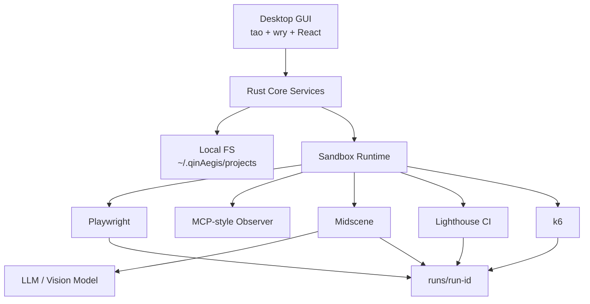

# QinAegis

Desktop GUI AI quality engineering platform for Web applications.

## Positioning

qinAegis is not another browser automation SDK. It is a productized testing workbench that combines mature open-source automation tools with local test asset governance, sandbox execution, failure review, and quality gates.

## Features

- **Desktop GUI Application** — Double-click to use, no terminal required
- **AI-Powered Exploration** — Visual-driven project discovery
- **Test Case Generation** — Natural language to executable test cases
- **Sandbox Execution** — Playwright-managed browser isolation
- **Quality Gates** — E2E pass rate, performance, and stress testing
- **Local Storage** — All data stays on your machine under `~/.qinAegis/`

## Installation

### Homebrew (Recommended)

```bash
brew install --cask mbpz/qinAegis/qinAegis
```

After installation, find **QinAegis.app** in your Applications folder.

### From Source

```bash
git clone https://github.com/mbpz/qinAegis.git
cd qinAegis

# Build React UI
cd crates/web_client/ui && npm install && npm run build && cd ../..

# Build Rust binary
cargo build --release --bin qinAegis-web
```

## Technology Stack

| Layer | Technology | Role |
|---|---|---|
| **Desktop App** | Rust + tao + wry | Native WebView2/webkit GUI |
| **Frontend** | React + TypeScript + Vite | User interface |
| **Core Services** | Rust + tokio | Business logic |
| **Storage** | Local filesystem | `~/.qinAegis/projects/` |
| **Browser** | Playwright | Browser process management |
| **Visual AI** | Midscene.js | Visual act/assert/extract |
| **Performance** | Lighthouse CI | Web Vitals measurement |
| **Load Testing** | k6 | Stress and load thresholds |

## Architecture



## User Workflow

1. **Launch** — Double-click QinAegis.app from Applications
2. **Configure** — Set AI model credentials in Settings
3. **Explore** — Enter project URL for AI-powered discovery
4. **Generate** — Create test cases from requirements
5. **Run** — Execute smoke, functional, performance, or stress tests
6. **Review** — View reports and quality gate status

## Development

```bash
# Setup React UI
cd crates/web_client/ui
npm install

# Development (watch mode)
npm run dev

# Build for production
npm run build

# Build Rust binary
cargo build --release --bin qinAegis-web
```

## Documentation

- [Roadmap](./qinAegis-platform-roadmap.md)
- [Architecture Design](./docs/superpowers/specs/2026-04-24-qinaegis-architecture-design.md)
- [User Guide](./docs/USER_GUIDE.md)
- [Install Guide](./INSTALL.md)
- [CI/CD Orchestration](./docs/orchestration.md)

## Integrations

- [OWASP ZAP Security Scanning](./docs/integrations/owasp-zap.md)
- [Stagehand AI Browser Automation](./docs/integrations/stagehand.md)
- [Playwright Test Agents Reference](./docs/integrations/playwright-test-agents.md)
- [Testplane Visual Regression](./docs/integrations/testplane.md)