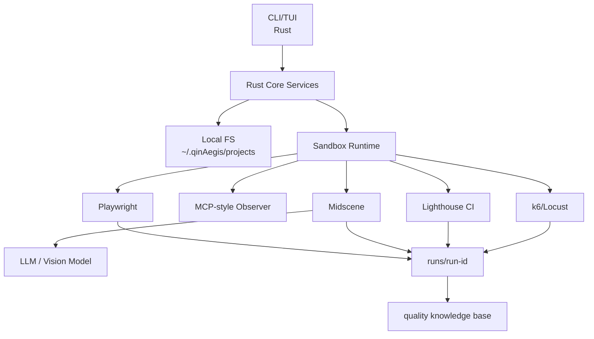
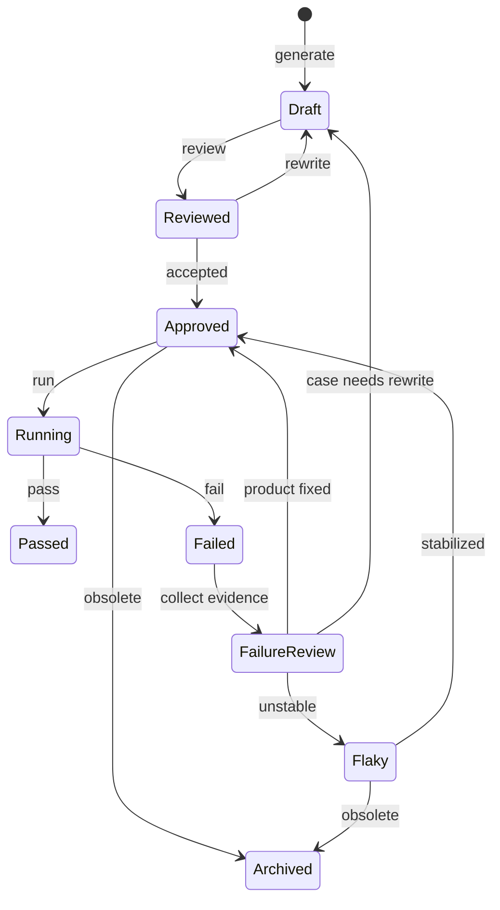

# qinAegis

本地优先的 AI 质量工程平台，专为 Web 项目设计。

qinAegis 不是另一个浏览器自动化 SDK。它是一款产品化的测试工作台，将成熟的开源自动化工具与本地测试资产治理、沙箱执行、失败复盘和质量门禁相结合。

## 定位

qinAegis 帮助 Web 团队从临时测试脚本走向持久的本地质量知识库：

```text
理解产品 -> 制定测试计划 -> 生成用例 -> 审核用例
-> 沙箱执行 -> 收集证据 -> 解释失败
-> 质量门禁 -> 更新项目知识
```

**核心原则：**

- **本地优先**：规格书、需求、用例、运行记录和知识库都存储在 `~/.qinAegis/projects/` 下。
- **不依赖 Notion**：外部协作工具仅为可选集成，非数据源。
- **结构化优于视觉**：在调用视觉模型之前，优先使用 accessibility snapshot、DOM、console 和 network 信号。
- **确定性优于 Agent 化**：已批准的回归用例应尽量减少 LLM 参与。
- **证据优先**：每次失败都应包含足够的证据，以分类为产品、测试、环境或模型相关问题。

## 技术栈

| 层级 | 技术 | 角色 |
|------|------|------|
| CLI/TUI | Rust + clap + ratatui | 本地工作流和项目仪表板 |
| 核心服务 | Rust + tokio | 项目、需求、用例、运行、报告和门禁编排 |
| 存储 | 本地文件系统 | 数据源 `~/.qinAegis/projects/` |
| 浏览器会话 | Playwright | 浏览器进程管理、隔离上下文 |
| 确定性自动化 | Playwright | 稳定动作、trace、截图、console、network |
| 结构化观测 | MCP-style accessibility snapshot | 低成本页面状态用于 AI 规划 |
| 视觉自动化 | Midscene.js | 复杂 UI 的视觉 act/assert/extract |
| 性能 | Lighthouse CI model | Web 性能预算 |
| 负载/压测 | k6 / Locust | 负载阈值和压测结果 |

## 本地数据模型

```text
~/.qinAegis/
  config.toml
  projects/
    <project-name>/
      project.yaml
      spec/
        product.md
        routes.json
        ui-map.json
      requirements/
        *.md
      cases/
        draft/
        reviewed/
        approved/
        flaky/
        archived/
      runs/
        <run-id>/
          result.json
          summary.md
          report.html
          screenshots/
          trace/
          console.json
          network.json
          lighthouse.json
          k6-summary.json
      knowledge/
        coverage.json
        flakiness.json
        failure-patterns.json
```

## 使用流程

```bash
qinAegis init                           # 初始化配置
qinAegis project add --name admin --url http://localhost:3000  # 添加项目
qinAegis explore --project admin       # AI 探索项目
qinAegis generate --project admin --requirement requirements/login.md  # 生成用例
qinAegis review --project admin          # 审核用例
qinAegis run --project admin --test-type smoke  # 执行冒烟测试
qinAegis performance --url http://localhost:3000  # 性能测试
qinAegis stress --target http://localhost:3000 --users 100  # 压测
qinAegis gate --project admin           # 质量门禁
qinAegis export --project admin --format html  # 导出报告
```

## 架构



## 测试用例生命周期



## 开发

```bash
cargo build
cargo test

cd sandbox
pnpm install
pnpm test
```

本地运行 CLI：

```bash
cargo run -p qinAegis -- --help
```

## 文档

- [Roadmap](./qinAegis-platform-roadmap.md) - 完整架构文档
- [Architecture Design](./docs/superpowers/specs/2026-04-24-qinaegis-architecture-design.md) - 架构设计
- [User Guide](./docs/USER_GUIDE.md) - 用户手册
- [Install Guide](./INSTALL.md) - 安装指南

## 无 Docker 要求

qinAegis 使用 Playwright 直接管理浏览器实例，无需 Docker 或容器运行时。