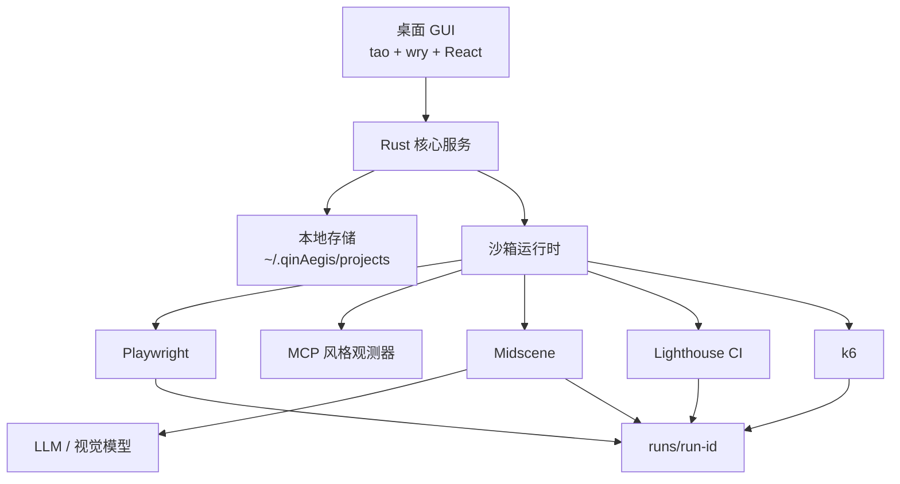

# qinAegis

本地优先的 AI 质量工程桌面应用。

qinAegis 不是又一个浏览器自动化 SDK。它是一个产品化的测试工作台，将成熟的开源自动化工具与本地测试资产治理、沙箱执行、失败复盘和质量门禁结合在一起。

## 核心特性

- **桌面 GUI 应用** — 双击即可使用，无需终端
- **AI 驱动探索** — 可视化项目发现
- **测试用例生成** — 自然语言转可执行测试
- **沙箱执行** — Playwright 管理的浏览器隔离
- **质量门禁** — E2E 通过率、性能、压测
- **本地存储** — 所有数据保存在 `~/.qinAegis/`

## 技术栈

| 层级 | 技术 | 用途 |
|---|---|---|
| **桌面应用** | Rust + tao + wry | 原生 WebView2/WebKit GUI |
| **前端** | React + TypeScript + Vite | 用户界面 |
| **核心服务** | Rust + tokio | 业务逻辑 |
| **存储** | 本地文件系统 | `~/.qinAegis/projects/` |
| **浏览器** | Playwright | 浏览器进程管理 |
| **视觉 AI** | Midscene.js | 视觉操作/断言/抽取 |
| **性能测试** | Lighthouse CI | Web Vitals 指标 |
| **压测** | k6 | 负载和压测阈值 |

## 安装

### Homebrew（推荐）

```bash
brew install --cask mbpz/qinAegis/qinAegis
```

安装完成后，在应用程序文件夹中找到 **QinAegis.app**，双击即可使用。

### 从源码构建

```bash
git clone https://github.com/mbpz/qinAegis.git
cd qinAegis

# 构建 React UI
cd crates/web_client/ui && npm install && npm run build && cd ../..

# 构建 Rust 二进制
cargo build --release --bin qinAegis-web
```

## 架构



## 用户工作流

1. **启动** — 从应用程序文件夹双击 QinAegis.app
2. **配置** — 在设置中填写 AI 模型凭证
3. **探索** — 输入项目 URL 进行 AI 驱动的发现
4. **生成** — 从需求描述创建测试用例
5. **执行** — 运行冒烟、功能、性能或压测
6. **复盘** — 查看报告和质量门禁状态

## 开发

```bash
# 安装 React 依赖
cd crates/web_client/ui
npm install

# 开发模式（热更新）
npm run dev

# 生产构建
npm run build

# 构建 Rust 二进制
cargo build --release --bin qinAegis-web
```

## 文档

- [路线图](./qinAegis-platform-roadmap.md)
- [架构设计](./docs/superpowers/specs/2026-04-24-qinaegis-architecture-design.md)
- [用户指南](./docs/USER_GUIDE.md)
- [安装指南](./INSTALL.md)
- [CI/CD 编排](./docs/orchestration.md)

## 集成

- [OWASP ZAP 安全扫描](./docs/integrations/owasp-zap.md)
- [Stagehand AI 浏览器自动化](./docs/integrations/stagehand.md)
- [Playwright Test Agents 参考](./docs/integrations/playwright-test-agents.md)
- [Testplane 视觉回归](./docs/integrations/testplane.md)