# qinAegis 市场成熟方案对标与技术流程设计

## 1. 结论

qinAegis 对标的不是单个 GitHub 项目，而是一组已经被市场验证的测试平台能力组合：

- 微软验证了 **Playwright + Trace + MCP + Test Agents**。
- Google 验证了 **Chrome DevTools Recorder + Lighthouse CI + Firebase Test Lab**。
- BrowserStack / Sauce Labs 验证了 **浏览器/设备执行网格 + 运行证据 + CI 集成**。
- Cypress Cloud 验证了 **失败回放、flaky 管理、CI 调试体验**。
- Applitools 验证了 **AI 视觉测试和视觉 baseline 审核**。
- mabl / Testim / Functionize 验证了 **AI 生成、低代码测试、自愈维护、持续质量平台**。
- Tricentis Tosca 验证了 **模型驱动测试、风险驱动覆盖、企业级测试治理**。
- Selenium / WebDriver 验证了 **跨浏览器自动化协议和生态标准**。
- Lighthouse CI / k6 验证了 **性能/压测门禁可工程化落地**。

qinAegis 的最佳定位：

> 本地优先的 AI Quality Workbench，把产品理解、测试生成、测试资产治理、沙箱执行、失败复盘和质量门禁串成闭环。

它不应成为“另一个 AI 浏览器 SDK”，而应成为这些成熟能力的本地产品化整合层。

## 2. 总体对标地图

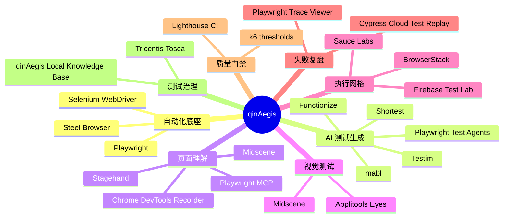
```mermaid
mindmap
  root((qinAegis))
    自动化底座
      Playwright
      Selenium WebDriver
      Steel Browser
    AI 测试生成
      Playwright Test Agents
      mabl
      Testim
      Functionize
      Shortest
    页面理解
      Playwright MCP
      Chrome DevTools Recorder
      Midscene
      Stagehand
    视觉测试
      Applitools Eyes
      Midscene
    执行网格
      BrowserStack
      Sauce Labs
      Firebase Test Lab
    失败复盘
      Cypress Cloud Test Replay
      Playwright Trace Viewer
    质量门禁
      Lighthouse CI
      k6 thresholds
    测试治理
      Tricentis Tosca
      qinAegis Local Knowledge Base
```

## 3. 成熟方案分层对比

| 层级 | 成熟代表 | 已验证能力 | qinAegis 吸收方式 |
|---|---|---|---|
| 浏览器自动化 | Playwright / Selenium | 跨浏览器执行、trace、CI、生态标准 | Playwright 作为默认执行底座，Selenium/WebDriver 保持远期兼容视角 |
| AI 浏览器操作 | Playwright MCP / Stagehand / Midscene | 结构化观测、自然语言动作、视觉断言 | 统一 `observe/act/extract/assert` 抽象 |
| AI 测试生成 | Playwright Test Agents / mabl / Testim / Functionize | planner/generator/healer/self-healing | 生成只进 draft，review 后才 approved |
| 云端执行 | BrowserStack / Sauce Labs / Firebase Test Lab | 浏览器/设备矩阵、视频、日志、CI | 本地优先，远期增加 remote executor provider |
| 失败复盘 | Cypress Cloud / Playwright Trace | replay、trace、console、network、flaky 管理 | 每次失败写入 `runs/<run-id>/` 和 `knowledge/flakiness.json` |
| 视觉回归 | Applitools / Midscene | Visual AI、baseline、视觉差异审核 | `visual-baseline/` 作为未来扩展 |
| 性能压测 | Lighthouse CI / k6 | budgets、thresholds、exit code | `qinAegis gate` 统一门禁 |
| 测试治理 | Tricentis Tosca | 模型驱动、风险覆盖、企业治理 | spec/ui-map/coverage 形成质量知识库 |

## 4. 微软路线：Playwright + MCP + Test Agents

### 4.1 成熟能力

微软路线是 qinAegis 最重要的技术底座参考：

- Playwright：现代 Web E2E 自动化底座。
- Trace Viewer：动作、截图、网络、console、DOM 级失败复盘。
- UI Mode / Codegen：测试开发和调试体验。
- Playwright MCP：给 AI 工具提供结构化浏览器操作能力。
- Playwright Test Agents：planner / generator / healer 三类 agent。

### 4.2 技术流程图

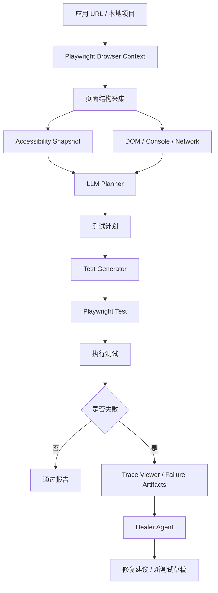
```mermaid
flowchart TD
    A[应用 URL / 本地项目] --> B[Playwright Browser Context]
    B --> C[页面结构采集]
    C --> D[Accessibility Snapshot]
    C --> E[DOM / Console / Network]
    D --> F[LLM Planner]
    E --> F
    F --> G[测试计划]
    G --> H[Test Generator]
    H --> I[Playwright Test]
    I --> J[执行测试]
    J --> K{是否失败}
    K -- 否 --> L[通过报告]
    K -- 是 --> M[Trace Viewer / Failure Artifacts]
    M --> N[Healer Agent]
    N --> O[修复建议 / 新测试草稿]
```

### 4.3 qinAegis 吸收方案

qinAegis 应采用类似链路，但加上本地资产治理：

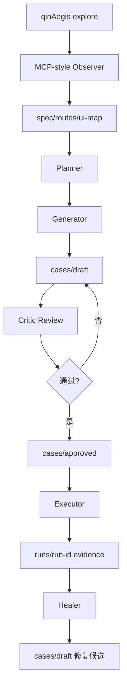
```mermaid
flowchart TD
    A[qinAegis explore] --> B[MCP-style Observer]
    B --> C[spec/routes/ui-map]
    C --> D[Planner]
    D --> E[Generator]
    E --> F[cases/draft]
    F --> G[Critic Review]
    G --> H{通过?}
    H -- 是 --> I[cases/approved]
    H -- 否 --> F
    I --> J[Executor]
    J --> K[runs/run-id evidence]
    K --> L[Healer]
    L --> M[cases/draft 修复候选]
```

关键取舍：

- Playwright 负责确定性动作和 evidence。
- MCP-style observer 负责低成本结构化页面理解。
- Healer 不直接改 approved，只能生成 draft。

## 5. Google 路线：Recorder + Lighthouse CI + Test Lab

### 5.1 成熟能力

Google 的能力分散在浏览器、性能和设备云：

- Chrome DevTools Recorder：录制和回放用户流程。
- Lighthouse / Lighthouse CI：性能、可访问性、SEO、PWA 等审计和 CI 断言。
- Firebase Test Lab：移动端设备云测试。

### 5.2 技术流程图

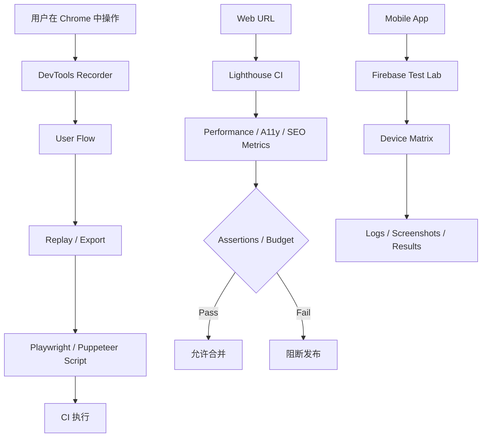
```mermaid
flowchart TD
    A[用户在 Chrome 中操作] --> B[DevTools Recorder]
    B --> C[User Flow]
    C --> D[Replay / Export]
    D --> E[Playwright / Puppeteer Script]
    E --> F[CI 执行]

    G[Web URL] --> H[Lighthouse CI]
    H --> I[Performance / A11y / SEO Metrics]
    I --> J{Assertions / Budget}
    J -- Pass --> K[允许合并]
    J -- Fail --> L[阻断发布]

    M[Mobile App] --> N[Firebase Test Lab]
    N --> O[Device Matrix]
    O --> P[Logs / Screenshots / Results]
```

### 5.3 qinAegis 吸收方案

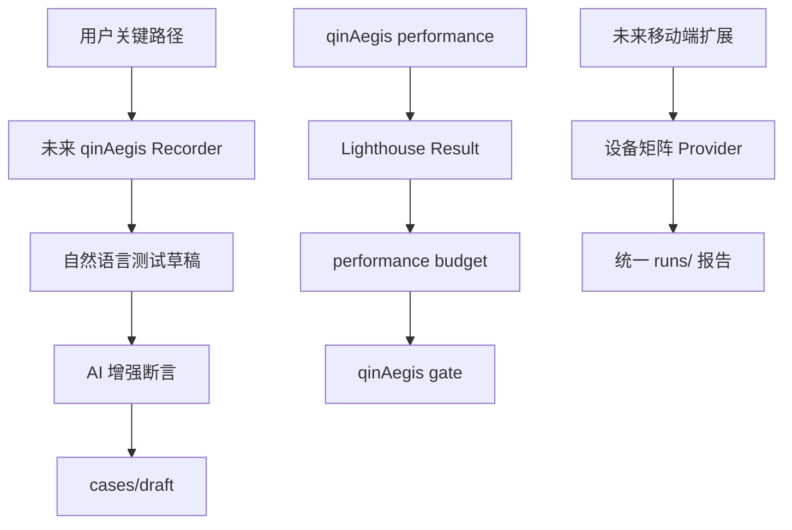
```mermaid
flowchart TD
    A[用户关键路径] --> B[未来 qinAegis Recorder]
    B --> C[自然语言测试草稿]
    C --> D[AI 增强断言]
    D --> E[cases/draft]

    F[qinAegis performance] --> G[Lighthouse Result]
    G --> H[performance budget]
    H --> I[qinAegis gate]

    J[未来移动端扩展] --> K[设备矩阵 Provider]
    K --> L[统一 runs/ 报告]
```

关键取舍：

- 短期只吸收 Lighthouse CI 的 performance gate。
- Recorder 能力可作为中期 TUI/CLI 交互增强。
- Firebase Test Lab 仅作为未来移动端设备矩阵参考。

## 6. BrowserStack / Sauce Labs 路线：执行网格 + 证据平台

### 6.1 成熟能力

云测平台的核心价值不是 AI，而是：

- 大规模浏览器/设备矩阵。
- Selenium / Playwright / Cypress 等框架兼容。
- 视频、截图、网络、console、设备日志。
- Local Testing / Tunnel 访问内网环境。
- CI/CD 集成和团队报告。

### 6.2 技术流程图

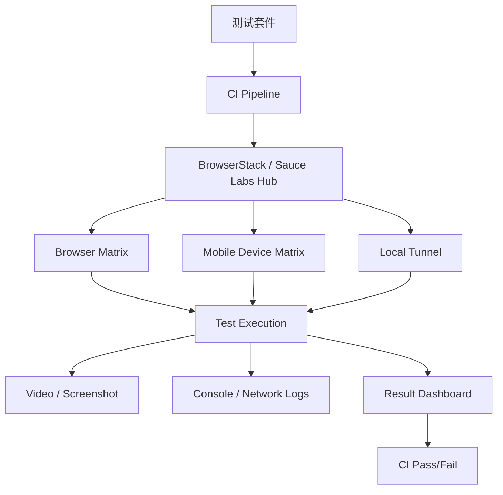
```mermaid
flowchart TD
    A[测试套件] --> B[CI Pipeline]
    B --> C[BrowserStack / Sauce Labs Hub]
    C --> D[Browser Matrix]
    C --> E[Mobile Device Matrix]
    C --> F[Local Tunnel]

    D --> G[Test Execution]
    E --> G
    F --> G
    G --> H[Video / Screenshot]
    G --> I[Console / Network Logs]
    G --> J[Result Dashboard]
    J --> K[CI Pass/Fail]
```

### 6.3 qinAegis 吸收方案

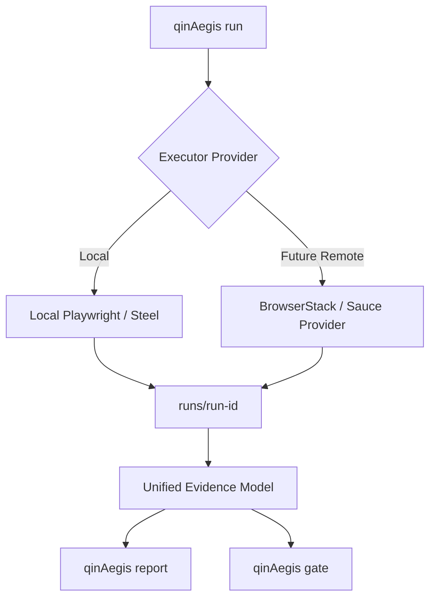
```mermaid
flowchart TD
    A[qinAegis run] --> B{Executor Provider}
    B -- Local --> C[Local Playwright / Steel]
    B -- Future Remote --> D[BrowserStack / Sauce Provider]
    C --> E[runs/run-id]
    D --> E
    E --> F[Unified Evidence Model]
    F --> G[qinAegis report]
    F --> H[qinAegis gate]
```

关键取舍：

- qinAegis 短期保持本地优先。
- 远期抽象 remote executor provider。
- 无论本地还是云端，都归一化到 `runs/<run-id>/`。

## 7. Cypress Cloud 路线：失败复盘 + Flaky 管理

### 7.1 成熟能力

Cypress Cloud 的市场验证点：

- Test Replay：回放 CI 中失败现场。
- 捕获命令、DOM、console、network、错误。
- Flaky test detection 和 flaky 管理。
- CI 调试协作体验。

### 7.2 技术流程图

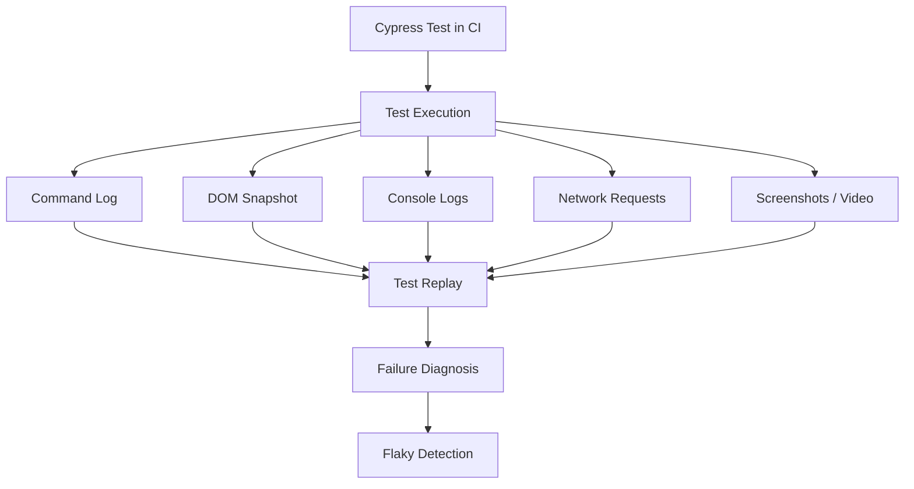
```mermaid
flowchart TD
    A[Cypress Test in CI] --> B[Test Execution]
    B --> C[Command Log]
    B --> D[DOM Snapshot]
    B --> E[Console Logs]
    B --> F[Network Requests]
    B --> G[Screenshots / Video]
    C --> H[Test Replay]
    D --> H
    E --> H
    F --> H
    G --> H
    H --> I[Failure Diagnosis]
    I --> J[Flaky Detection]
```

### 7.3 qinAegis 吸收方案

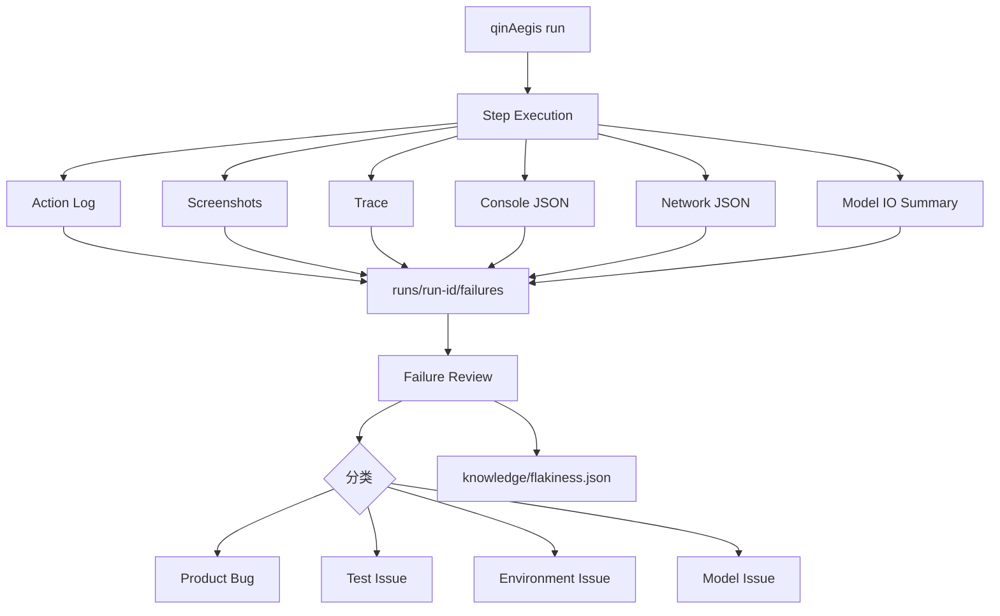
```mermaid
flowchart TD
    A[qinAegis run] --> B[Step Execution]
    B --> C[Action Log]
    B --> D[Screenshots]
    B --> E[Trace]
    B --> F[Console JSON]
    B --> G[Network JSON]
    B --> H[Model IO Summary]
    C --> I[runs/run-id/failures]
    D --> I
    E --> I
    F --> I
    G --> I
    H --> I
    I --> J[Failure Review]
    J --> K{分类}
    K --> L[Product Bug]
    K --> M[Test Issue]
    K --> N[Environment Issue]
    K --> O[Model Issue]
    J --> P[knowledge/flakiness.json]
```

关键取舍：

- qinAegis 的失败报告不能只有截图。
- `flaky` 应是测试资产生命周期的一等状态。
- 每次失败都要可解释、可复盘、可转化为修复建议。

## 8. Applitools 路线：AI 视觉测试 + Baseline

### 8.1 成熟能力

Applitools 验证了视觉 AI 测试的商业价值：

- Visual AI 识别 UI 差异。
- Baseline 管理。
- 跨浏览器/设备视觉检查。
- 视觉差异审核流程。

### 8.2 技术流程图

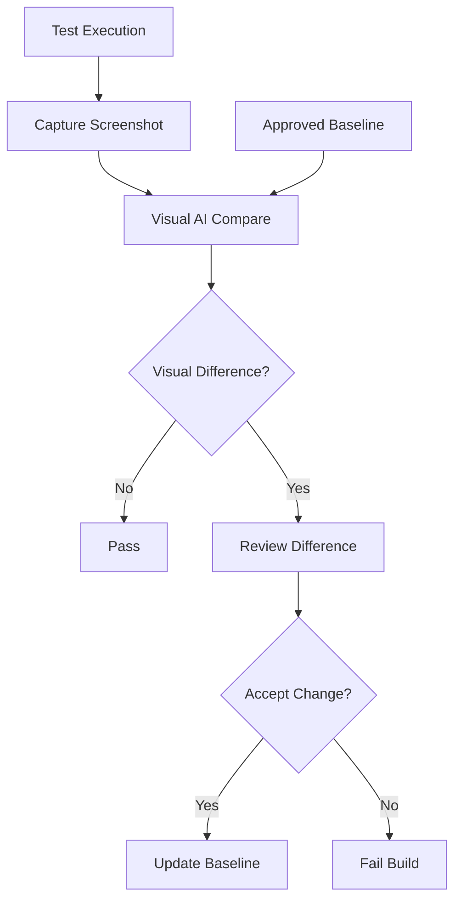
```mermaid
flowchart TD
    A[Test Execution] --> B[Capture Screenshot]
    B --> C[Visual AI Compare]
    D[Approved Baseline] --> C
    C --> E{Visual Difference?}
    E -- No --> F[Pass]
    E -- Yes --> G[Review Difference]
    G --> H{Accept Change?}
    H -- Yes --> I[Update Baseline]
    H -- No --> J[Fail Build]
```

### 8.3 qinAegis 吸收方案

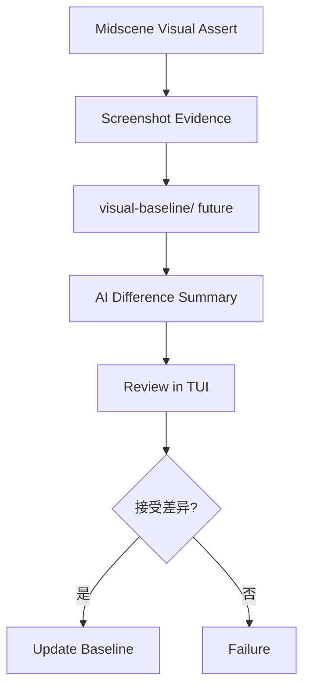
```mermaid
flowchart TD
    A[Midscene Visual Assert] --> B[Screenshot Evidence]
    B --> C[visual-baseline/ future]
    C --> D[AI Difference Summary]
    D --> E[Review in TUI]
    E --> F{接受差异?}
    F -- 是 --> G[Update Baseline]
    F -- 否 --> H[Failure]
```

关键取舍：

- qinAegis 短期先做视觉断言和截图证据。
- 中期再做 baseline 管理。
- 视觉结果要进入 review，不应所有视觉差异都自动 fail。

## 9. mabl / Testim / Functionize 路线：AI 测试平台

### 9.1 成熟能力

这类商业平台证明 AI 测试平台有明确市场：

- 低代码/自然语言生成测试。
- 自愈 locator。
- 持续回归。
- 结果分析。
- 面向非纯工程用户的测试维护体验。

### 9.2 技术流程图

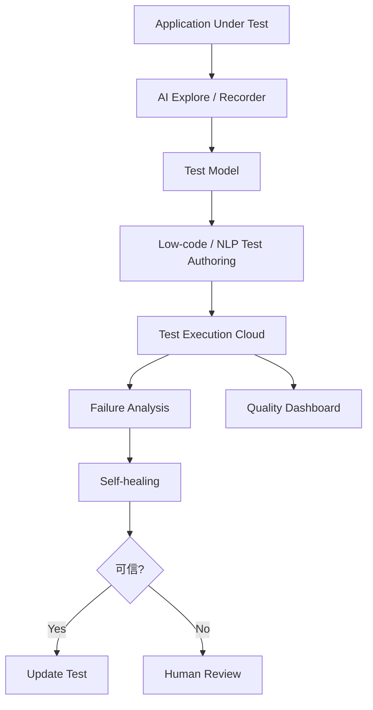
```mermaid
flowchart TD
    A[Application Under Test] --> B[AI Explore / Recorder]
    B --> C[Test Model]
    C --> D[Low-code / NLP Test Authoring]
    D --> E[Test Execution Cloud]
    E --> F[Failure Analysis]
    F --> G[Self-healing]
    G --> H{可信?}
    H -- Yes --> I[Update Test]
    H -- No --> J[Human Review]
    E --> K[Quality Dashboard]
```

### 9.3 qinAegis 吸收方案

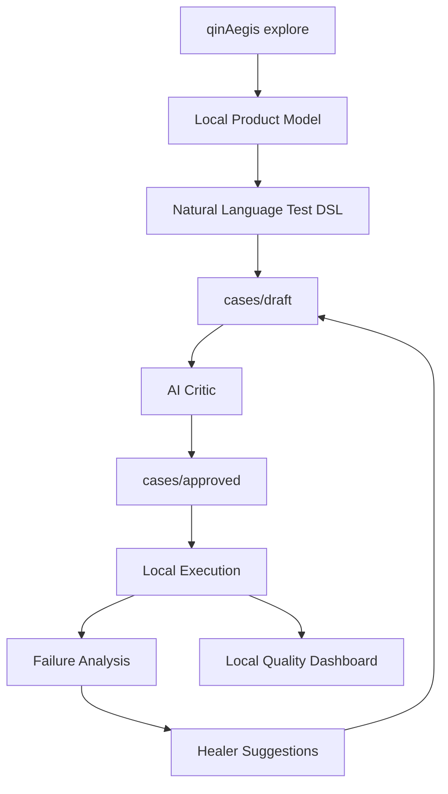
```mermaid
flowchart TD
    A[qinAegis explore] --> B[Local Product Model]
    B --> C[Natural Language Test DSL]
    C --> D[cases/draft]
    D --> E[AI Critic]
    E --> F[cases/approved]
    F --> G[Local Execution]
    G --> H[Failure Analysis]
    H --> I[Healer Suggestions]
    I --> D
    G --> J[Local Quality Dashboard]
```

关键取舍：

- 自愈不能直接改稳定用例。
- 任何 AI 修改都必须进入 draft/review。
- qinAegis 的差异点是本地优先、可审计、可 Git 管理。

## 10. Tricentis Tosca 路线：模型驱动 + 风险覆盖

### 10.1 成熟能力

Tosca 类企业测试平台的价值在治理：

- Model-based testing。
- Risk-based testing。
- 测试资产长期维护。
- 企业级覆盖视图。

### 10.2 技术流程图

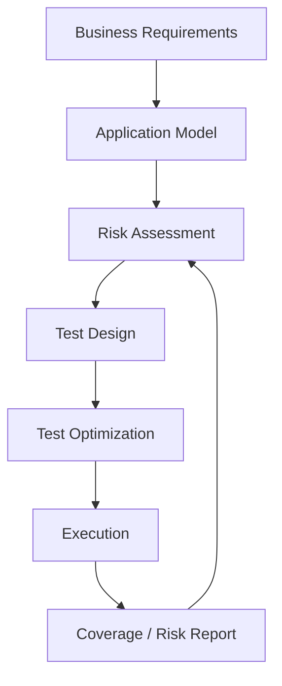
```mermaid
flowchart TD
    A[Business Requirements] --> B[Application Model]
    B --> C[Risk Assessment]
    C --> D[Test Design]
    D --> E[Test Optimization]
    E --> F[Execution]
    F --> G[Coverage / Risk Report]
    G --> C
```

### 10.3 qinAegis 吸收方案

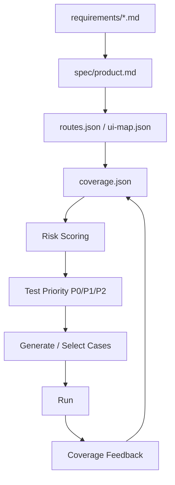
```mermaid
flowchart TD
    A[requirements/*.md] --> B[spec/product.md]
    B --> C[routes.json / ui-map.json]
    C --> D[coverage.json]
    D --> E[Risk Scoring]
    E --> F[Test Priority P0/P1/P2]
    F --> G[Generate / Select Cases]
    G --> H[Run]
    H --> I[Coverage Feedback]
    I --> D
```

关键取舍：

- qinAegis 的 `spec/` 不只是文档，而是测试模型。
- P0/P1/P2 应由业务风险、页面重要性、历史失败共同决定。
- 质量知识库是长期壁垒。

## 11. Selenium / WebDriver 路线：协议标准与生态

### 11.1 成熟能力

Selenium/WebDriver 验证了跨浏览器自动化协议的长期价值：

- 语言绑定丰富。
- 跨浏览器。
- Selenium Grid。
- W3C WebDriver 生态。

### 11.2 技术流程图

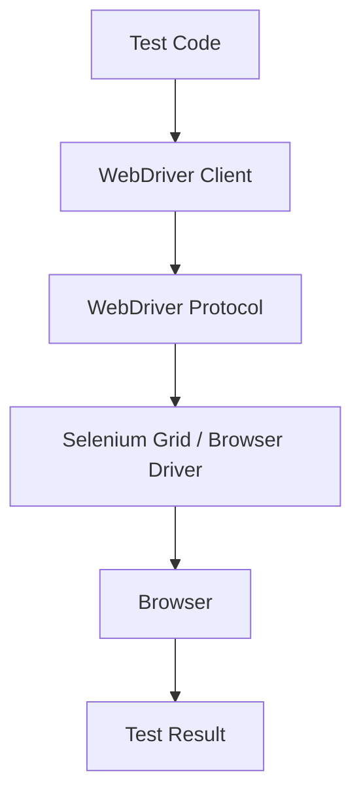
```mermaid
flowchart TD
    A[Test Code] --> B[WebDriver Client]
    B --> C[WebDriver Protocol]
    C --> D[Selenium Grid / Browser Driver]
    D --> E[Browser]
    E --> F[Test Result]
```

### 11.3 qinAegis 吸收方案

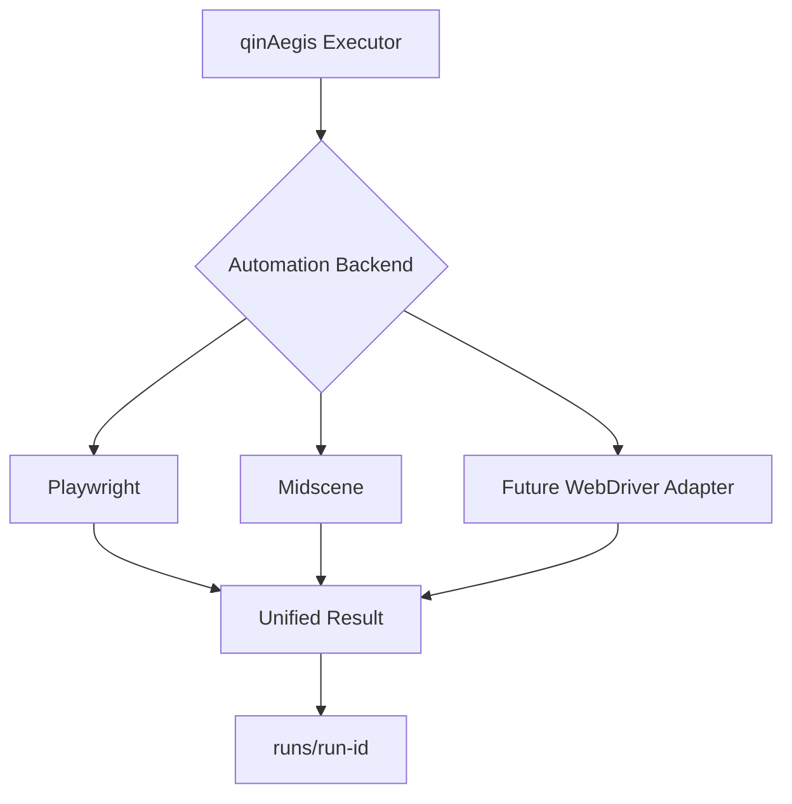
```mermaid
flowchart TD
    A[qinAegis Executor] --> B{Automation Backend}
    B --> C[Playwright]
    B --> D[Midscene]
    B --> E[Future WebDriver Adapter]
    C --> F[Unified Result]
    D --> F
    E --> F
    F --> G[runs/run-id]
```

关键取舍：

- 短期不需要实现 WebDriver。
- 但执行器接口必须避免被单一框架锁死。

## 12. Lighthouse CI / k6 路线：质量门禁

### 12.1 成熟能力

Lighthouse CI 和 k6 的共同点是：它们能把质量指标变成机器可判断的 pass/fail。

- Lighthouse CI：性能、可访问性、SEO、PWA 等预算和断言。
- k6：checks、thresholds、scenarios、error rate、latency percentiles。

### 12.2 技术流程图

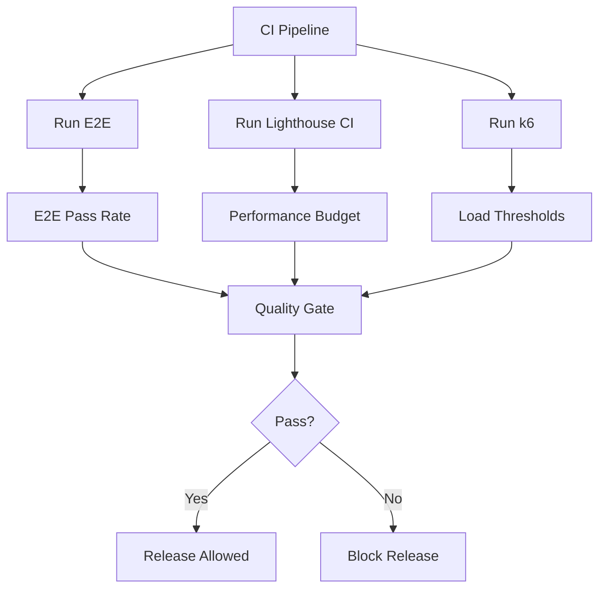
```mermaid
flowchart TD
    A[CI Pipeline] --> B[Run E2E]
    A --> C[Run Lighthouse CI]
    A --> D[Run k6]
    B --> E[E2E Pass Rate]
    C --> F[Performance Budget]
    D --> G[Load Thresholds]
    E --> H[Quality Gate]
    F --> H
    G --> H
    H --> I{Pass?}
    I -- Yes --> J[Release Allowed]
    I -- No --> K[Block Release]
```

### 12.3 qinAegis 吸收方案

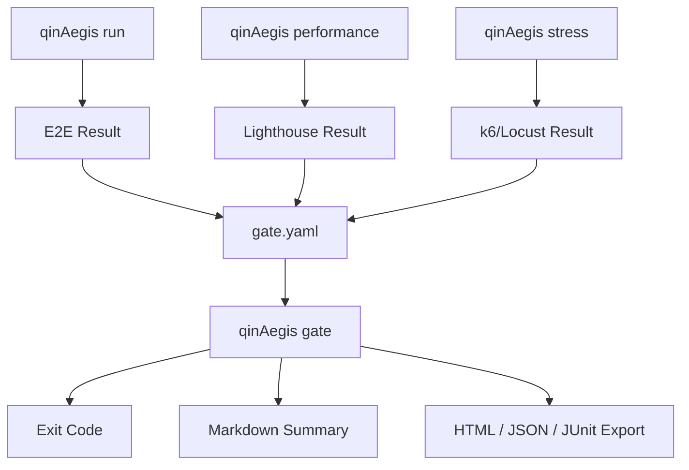
```mermaid
flowchart TD
    A[qinAegis run] --> B[E2E Result]
    C[qinAegis performance] --> D[Lighthouse Result]
    E[qinAegis stress] --> F[k6/Locust Result]
    B --> G[gate.yaml]
    D --> G
    F --> G
    G --> H[qinAegis gate]
    H --> I[Exit Code]
    H --> J[Markdown Summary]
    H --> K[HTML / JSON / JUnit Export]
```

推荐 gate：

```yaml
gate:
  e2e:
    pass_rate: ">= 95%"
    p0_failures: 0
    flaky_rate: "<= 3%"
  performance:
    lcp: "<= 2500"
    cls: "<= 0.1"
    performance_score: ">= 80"
  load:
    p95_ms: "<= 500"
    error_rate: "<= 1%"
```

## 13. qinAegis 目标架构

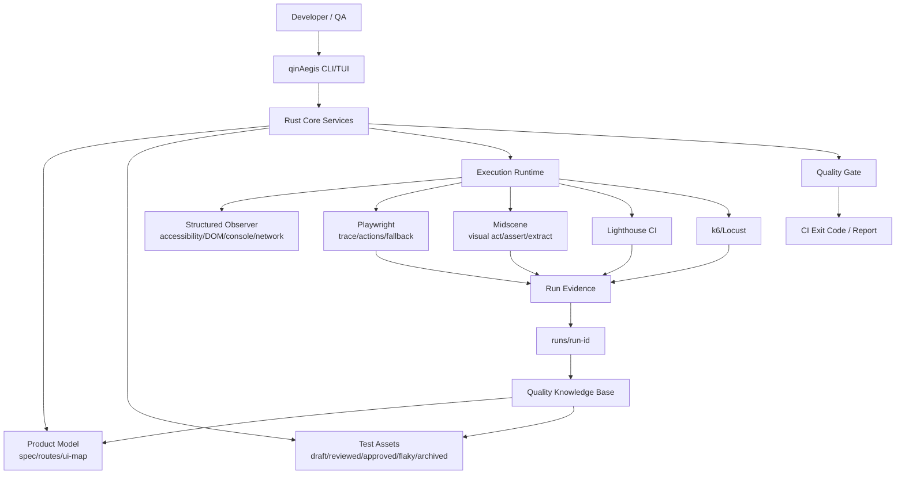
```mermaid
flowchart TB
    User[Developer / QA] --> TUI[qinAegis CLI/TUI]
    TUI --> Services[Rust Core Services]

    Services --> Product[Product Model<br/>spec/routes/ui-map]
    Services --> Cases[Test Assets<br/>draft/reviewed/approved/flaky/archived]
    Services --> Runtime[Execution Runtime]
    Services --> Gate[Quality Gate]

    Runtime --> Observer[Structured Observer<br/>accessibility/DOM/console/network]
    Runtime --> Playwright[Playwright<br/>trace/actions/fallback]
    Runtime --> Midscene[Midscene<br/>visual act/assert/extract]
    Runtime --> Perf[Lighthouse CI]
    Runtime --> Load[k6/Locust]

    Playwright --> Evidence[Run Evidence]
    Midscene --> Evidence
    Perf --> Evidence
    Load --> Evidence

    Evidence --> Runs[runs/run-id]
    Runs --> Knowledge[Quality Knowledge Base]
    Knowledge --> Product
    Knowledge --> Cases
    Gate --> CI[CI Exit Code / Report]
```

## 14. qinAegis 应优先实现的经过验证能力

优先级 1：

1. Playwright trace / screenshot / console / network evidence。
2. Local FS 资产模型。
3. case lifecycle：draft / reviewed / approved / flaky / archived。
4. `qinAegis gate`：E2E pass rate + Lighthouse + k6。

优先级 2：

1. MCP-style observer。
2. Midscene visual fallback。
3. Failure review TUI。
4. Flaky knowledge base。

优先级 3：

1. Healer draft generation。
2. Visual baseline。
3. Remote executor provider。
4. Recorder。
5. Risk-based coverage scoring。

## 15. 最终定位

qinAegis 的成熟对标表达：

> 本地优先的 mabl/Testim + Playwright Test Agents + Cypress Test Replay + Lighthouse/k6 Gate 的开源工程师版本。

它的差异点：

- 本地优先，不强依赖 SaaS。
- 所有资产可 Git 管理。
- AI 生成和修复可审查。
- 失败证据可审计。
- E2E、性能、压测统一门禁。
- 随项目演进形成质量知识库。

