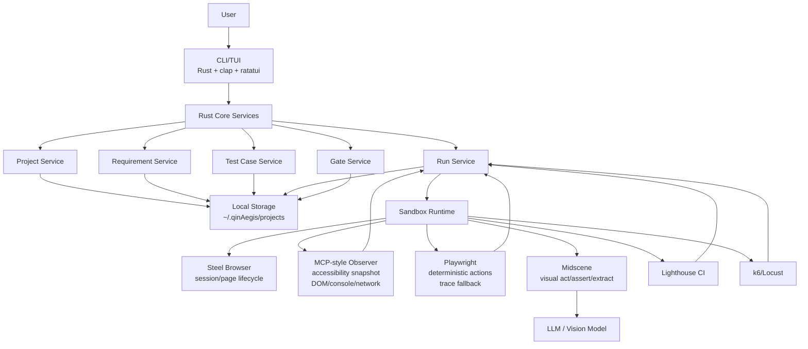
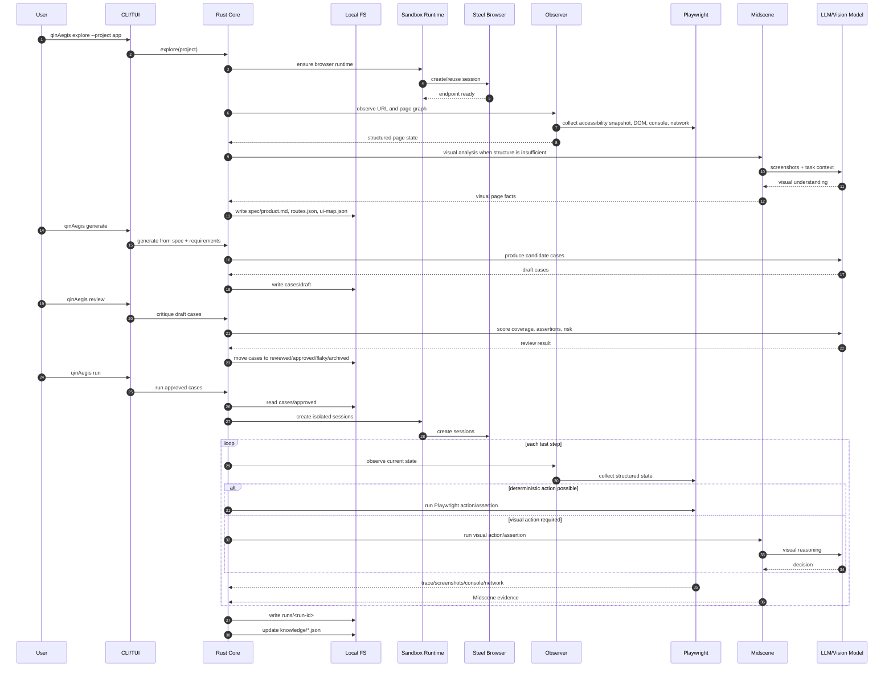
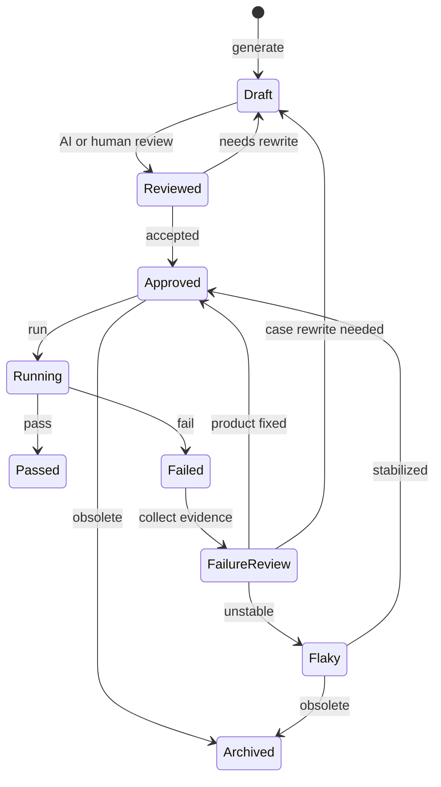

# QinAegis Architecture Design

> Version: v0.4
> Date: 2026-05-07
> Status: Draft

---

## 1. Overview

QinAegis is a local-first AI quality engineering platform for Web applications.

It combines:

- Rust CLI/TUI for local product workflow.
- Local filesystem storage as the source of truth.
- Steel Browser for isolated browser sessions.
- Playwright for deterministic automation, trace, console, and network evidence.
- MCP-style structured page observation through accessibility snapshots and DOM summaries.
- Midscene for visual UI automation, visual assertions, and complex UI extraction.
- Lighthouse CI and k6/Locust for performance and load gates.

QinAegis is not positioned as another browser automation SDK. It is the productized layer above mature open-source automation projects: test asset governance, run evidence, failure review, quality gates, and a project-specific quality knowledge base.

## 2. Product Pillars

- **Local-first**: all project data lives under `~/.qinAegis/projects/`.
- **No Notion core dependency**: collaboration tools are optional export/integration targets, not the source of truth.
- **Deterministic before agentic**: approved regression cases should execute with minimal LLM involvement.
- **Structured observation before vision**: accessibility snapshots, DOM summaries, console, and network signals are cheaper and more stable than screenshot-only reasoning.
- **Vision as a strong fallback**: Midscene handles visually complex pages, canvas-like UI, weak semantics, and screenshot-level assertions.
- **Evidence-first reporting**: every failure should carry enough screenshots, trace, console, network, and model summaries to decide whether it is a product, test, environment, or model issue.
- **Quality gate ready**: E2E, performance, and load results must be convertible into CI pass/fail signals.

## 3. Top-Level Architecture



## 4. Local Data Model

```text
~/.qinAegis/
  config.toml
  projects/
    <project-name>/
      project.yaml
      spec/
        product.md
        routes.json
        ui-map.json
      requirements/
        *.md
      cases/
        draft/
        reviewed/
        approved/
        flaky/
        archived/
      runs/
        <run-id>/
          result.json
          summary.md
          report.html
          screenshots/
          trace/
          console.json
          network.json
          model-io-summary.md
          lighthouse.json
          k6-summary.json
      knowledge/
        coverage.json
        flakiness.json
        failure-patterns.json
        environment.json
```

Local storage is the durable contract. Integrations such as GitHub Issues, Jira, Feishu, Linear, or Notion may be added later as exporters or synchronization adapters, but they must not replace the local source of truth.

## 5. Runtime Sequence



## 6. Module Breakdown

### 6.1 `crates/cli`

Responsibilities:

- CLI command parsing.
- TUI dashboard and workflow screens.
- Local setup wizard.
- Project, explore, generate, review, run, report, export, and gate command dispatch.

Key modules:

| Module | Purpose |
|---|---|
| `main.rs` | clap entry point |
| `tui/app.rs` | root TUI state and event loop |
| `tui/dashboard.rs` | project health dashboard |
| `commands/init.rs` | local config and sandbox setup |
| `commands/project.rs` | local project management |
| `commands/explore.rs` | project exploration |
| `commands/generate.rs` | test generation |
| `commands/run.rs` | test execution |
| `commands/export.rs` | report export |

### 6.2 `crates/core`

Responsibilities:

- LLM abstraction.
- Project exploration.
- Test case generation.
- AI critic/review.
- Test execution orchestration.
- Report normalization.
- Performance and load result normalization.

Key modules:

| Module | Purpose |
|---|---|
| `llm.rs` | model provider abstraction |
| `explorer.rs` | page and route exploration |
| `generator.rs` | test case generation |
| `critic.rs` | case review |
| `executor.rs` | approved case execution orchestration |
| `reporter.rs` | report generation |
| `performance.rs` | Lighthouse-oriented performance model |
| `stress.rs` | load/stress test model |
| `protocol.rs` | Rust ↔ TypeScript sandbox protocol |

### 6.3 `crates/core/src/storage`

Responsibilities:

- Local filesystem schema.
- Project config read/write.
- Requirements, specs, cases, runs, and knowledge artifacts.
- Future transactional writes for run artifacts.

### 6.4 `crates/core/src/automation`

Responsibilities:

- Stable automation trait.
- Midscene adapter.
- Future Playwright/MCP-style observer adapter.

Target abstraction:

```rust
trait BrowserAutomation {
    async fn observe(&self, instruction: &str) -> Result<Observation>;
    async fn act(&self, instruction: &str) -> Result<ActionResult>;
    async fn extract(&self, instruction: &str) -> Result<serde_json::Value>;
    async fn assert(&self, instruction: &str) -> Result<AssertionResult>;
}
```

### 6.5 `crates/core/src/sandbox`

Responsibilities:

- Browser runtime readiness.
- Steel Browser endpoint resolution.
- CDP/Playwright connection metadata.
- Session isolation policy.

### 6.6 `sandbox/`

Responsibilities:

- TypeScript executor for Midscene and Playwright.
- JSON line protocol over stdin/stdout.
- Browser connection via CDP endpoint.
- Evidence collection from Playwright and Midscene.

The current direction is subprocess-based JSON protocol, not `mlua`. This better matches Node.js package behavior and avoids embedding friction with Playwright/Midscene dependencies.

## 7. Execution Strategy

Approved cases should execute in this order:

1. Read approved test case.
2. Create or allocate isolated browser session.
3. Observe current page with structured signals.
4. Run deterministic Playwright action/assertion when possible.
5. Use Midscene visual act/assert/extract only when structure is insufficient.
6. Capture screenshots, trace, console, network, and model summaries.
7. Normalize result into `runs/<run-id>/result.json`.
8. Update quality knowledge base.
9. Evaluate quality gate.

## 8. Test Case Lifecycle



## 9. Quality Gate

Gate config example:

```yaml
gate:
  e2e:
    pass_rate: ">= 95%"
    p0_failures: 0
    flaky_rate: "<= 3%"
  performance:
    lcp: "<= 2500"
    cls: "<= 0.1"
    performance_score: ">= 80"
  load:
    p95_ms: "<= 500"
    error_rate: "<= 1%"
```

Gate outputs:

- Process exit code for CI.
- Markdown summary.
- JSON report.
- Optional JUnit/SARIF style exports.

## 10. Key Decisions

| Decision | Choice | Rationale |
|---|---|---|
| Source of truth | Local filesystem | Private, versionable, CI-friendly, no SaaS dependency |
| Browser session layer | Steel Browser | Avoid maintaining raw browser infrastructure |
| Deterministic automation | Playwright | Mature trace, console, network, and CI ecosystem |
| Structured AI observation | MCP-style accessibility snapshot | Lower cost and higher determinism than screenshot-only reasoning |
| Visual automation | Midscene | Strong UI vision capability for complex pages |
| Action abstraction | `observe/act/extract/assert` | Keeps Stagehand/Midscene/Playwright interchangeable |
| Case lifecycle | draft/reviewed/approved/flaky/archived | Prevents generated or healed cases from polluting regression assets |
| Process boundary | Rust core + Node sandbox subprocess | Fits Playwright/Midscene runtime model |
| Performance gate | Lighthouse CI model | Mature frontend performance budgets |
| Load gate | k6/Locust thresholds | Mature load-testing pass/fail metrics |

## 11. Open Risks

| Risk | Mitigation |
|---|---|
| LLM/vision nondeterminism | Use structured observation first; restrict LLM calls in approved regression |
| Browser session leakage | Per-run or per-case session policy; explicit cleanup hooks |
| Large evidence artifacts | Store summaries by default; keep full trace configurable |
| Flaky generated cases | Require review before approval; maintain flakiness knowledge |
| Scope creep | Prioritize E2E lifecycle before expanding performance/load dashboards |

## 12. Near-Term Implementation Order

1. Remove Notion from docs, commands, and config surfaces.
2. Finalize local filesystem schema and validation.
3. Add case lifecycle directories and status transitions.
4. Add MCP-style observer output in sandbox.
5. Improve run evidence capture.
6. Add `gate` and export formats.
7. Upgrade TUI dashboard to project health workflow.

