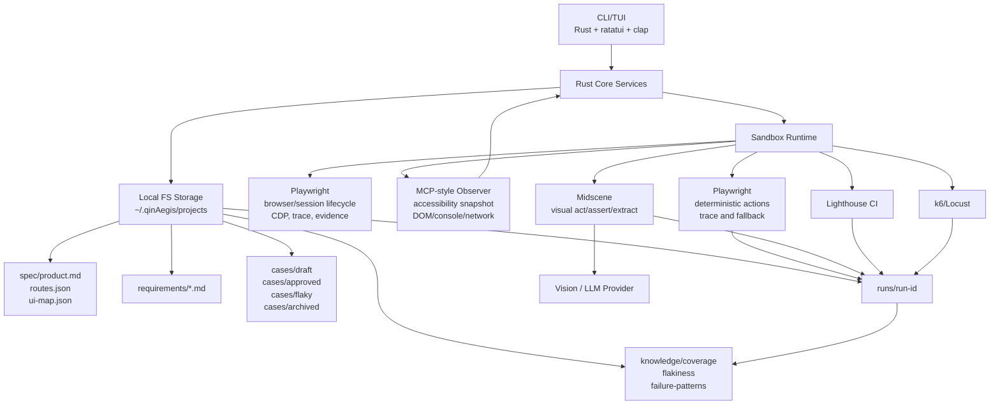

# AI 自动化测试平台 qinAegis Roadmap

> 基于开源成熟项目（Midscene.js · Playwright · Stagehand · Shortest · k6 · Lighthouse CI）的本地优先修正版本  
> 产物形态：macOS TUI/CLI 客户端 · brew 安装 · 完全本地沙箱 · 数据全量维护在本地文件系统

---

## 目录

0. [2026-05-07 技术路线修订](#0-2026-05-07-技术路线修订)
1. [项目概述](#1-项目概述)
2. [开源项目选型依据](#2-开源项目选型依据)
3. [整体架构](#3-整体架构)
4. [技术选型](#4-技术选型)
5. [Phase 1 · Bootstrap — 认证 + 沙箱搭建](#5-phase-1--bootstrap--认证--沙箱搭建)
6. [Phase 2 · AI Core — 视觉驱动执行引擎](#6-phase-2--ai-core--视觉驱动执行引擎)
7. [Phase 3 · Test Execution — 四类测试](#7-phase-3--test-execution--四类测试)
8. [Phase 4 · 本地数据模型](#8-phase-4--本地数据模型)
9. [Phase 5 · Distribution — Homebrew 分发](#9-phase-5--distribution--homebrew-分发)
10. [原方案 vs 修正方案对比](#10-原方案-vs-修正方案对比)
11. [开发里程碑](#11-开发里程碑)
12. [目录结构](#12-目录结构)

---

## 0. 2026-05-07 技术路线修订

最新 GitHub 同类项目对标后，qinAegis 的技术路线从“视觉模型驱动的自动化测试工具”升级为“本地优先的 AI 质量工程平台”：

- **不做另一个 AI 浏览器 SDK**：Midscene、Stagehand、Playwright 已经覆盖底层浏览器动作和会话能力，qinAegis 重点做测试资产、失败复盘、质量门禁和本地工作台。
- **去 Notion**：Notion 不再作为核心数据源。所有规格、需求、用例、运行记录、报告、质量知识库都落在 `~/.qinAegis/projects/`。
- **多通道观测**：优先使用 Playwright/MCP 风格的 accessibility snapshot、DOM、console、network 等结构化信号；复杂视觉 UI 再调用 Midscene/视觉模型。
- **动作抽象学习 Stagehand**：内部统一为 `observe`、`act`、`extract`、`assert` 四类能力，隐藏 Midscene、Playwright、未来 Stagehand/browser-use 等执行器差异。
- **测试 DSL 学习 Shortest，但补齐治理**：自然语言测试步骤只进入 draft，用例必须经过 AI/人工 review 才能进入 approved。
- **Agent 生成/修复学习 Playwright Test Agents**：采用 Explorer → Planner → Generator → Critic → Executor → Healer 的流水线；Healer 只能产出修复建议或 draft，不能直接污染 approved 用例。
- **质量门禁学习 k6/Lighthouse CI**：E2E、性能、压力测试都输出统一 gate 结果，支持 CI 阻断。

推荐运行时分层：

```text
qinAegis CLI/TUI (Rust)
  ├─ Project / Requirement / Case / Run / Gate Services
  ├─ Local FS Storage (~/.qinAegis/projects)
  └─ Sandbox Runtime
       ├─ Playwright: browser/session lifecycle, CDP, trace
       ├─ Midscene: visual act/assert/extract
       ├─ MCP-style Observer: accessibility snapshot and structured page state
       ├─ Lighthouse CI: performance budget
       └─ k6/Locust: load and stress thresholds
```

新的超越路径：

```text
产品理解 -> 测试计划 -> 用例生成 -> 用例审查 -> approved 资产库
-> 沙箱执行 -> 失败证据采集 -> 问题分类 -> 质量门禁
-> 覆盖缺口推荐 -> 长期质量知识库
```

---

## 1. 项目概述

### 产品定位

一款运行在 macOS 本地的 **TUI/CLI AI 质量工程平台**，专为前端 Web 项目设计。核心特性：

- **完全本地沙箱化**：测试执行在 Playwright 管理的浏览器进程内进行，与宿主机完全隔离
- **AI 驱动但可控**：结构化页面观测优先，视觉大模型处理复杂 UI，approved 用例尽量稳定复用
- **本地文件系统存储**：项目规格书、需求、测试用例、测试结果全部存储在 `~/.qinAegis/projects/`
- **测试资产治理**：draft / reviewed / approved / flaky / archived 生命周期
- **统一质量门禁**：E2E 通过率、性能预算、压测阈值统一输出 gate 结果
- **brew 一键安装**：用户体验对标 gh / lazygit 等成熟 CLI 工具

### 用户使用流程

```
brew install qinAegis
↓
qinAegis init           # 初始化本地配置（AI 模型密钥等）
↓
qinAegis project add    # 添加 Web 项目（URL + 技术栈）
↓
qinAegis explore        # AI 自动探索项目，生成规格书
↓
qinAegis generate       # 按需求维度生成测试用例 → 写入本地 cases/
↓
qinAegis run smoke      # 执行冒烟测试
qinAegis run full       # 执行完整功能测试
qinAegis run perf       # 执行性能测试
qinAegis run stress     # 执行压力测试
↓
qinAegis report         # 查看测试报告
qinAegis export         # 导出 HTML/MD/JSON 报告
```

---

## 2. 开源项目选型依据

调研了以下 GitHub 成熟项目后，对原方案进行了实质性修正：

### 核心依赖项目

| 项目 | 用途 | 选用原因 | qinAegis 吸收点 |
|------|-----------|------|---------|
| [web-infra-dev/midscene](https://github.com/web-infra-dev/midscene) | AI 视觉执行引擎 | 视觉定位、自然语言操作、视觉断言、内置 Report | 复杂 UI 的 visual act/assert/extract |
| [microsoft/playwright](https://github.com/microsoft/playwright) / Playwright MCP | 稳定自动化与结构化观测 | trace、console、network、accessibility snapshot、CI 生态成熟 | deterministic fallback、证据采集、MCP-style observer |
| [browserbase/stagehand](https://github.com/browserbase/stagehand) | AI 浏览器操作抽象 | act/extract/observe/agent 分层清晰 | 统一 `observe/act/extract/assert` 内部接口 |
| [antiwork/shortest](https://github.com/antiwork/shortest) | 自然语言 E2E 测试格式参考 | plain English 测试体验好 | 测试 DSL 参考，但增加本地治理和 review 状态机 |
| [browser-use/browser-use](https://github.com/browser-use/browser-use) | 通用 AI 浏览器 Agent | 多步网页任务编排能力强 | 参考 Agent loop，不作为 approved 回归执行默认模式 |
| [steel-dev/steel-browser](https://github.com/steel-dev/steel-browser) | 浏览器沙箱参考 | 开箱即用浏览器会话与 CDP 基础设施 | 已被 Playwright 原生方案取代 |
| [grafana/k6](https://github.com/grafana/k6) | 压力测试 | thresholds、scenarios、checks 成熟 | load gate |
| [GoogleChrome/lighthouse-ci](https://github.com/GoogleChrome/lighthouse-ci) | 性能持续检测 | 性能预算、断言、CI 友好 | performance gate |

### 关键修正：为什么放弃自研执行引擎

原方案计划自研 Generator + Evaluator 双 Agent，并手写 CDP 指令序列。调研后发现：

1. **底层动作不再自研**：Midscene、Stagehand、Playwright 已覆盖浏览器动作生成与执行。
2. **手写 CDP 指令维护成本极高**：`Page.navigate`、`Runtime.evaluate` 等原始 CDP 指令在页面结构变化后会失效。
3. **不能只依赖视觉模型**：视觉模型适合复杂 UI，但稳定回归应优先使用 accessibility snapshot、DOM、network、console 等结构化信号。
4. **平台价值在上层闭环**：测试资产治理、失败复盘、质量门禁、覆盖缺口和本地知识库是 qinAegis 的主要差异化。

---

## 3. 整体架构



### 数据流向

```
用户指令 (TUI)
    │
    ▼
项目理解 (accessibility snapshot + DOM/network/console + Midscene 视觉补强)
    │
    ▼
本地写入规格书 (projects/<name>/spec.md)
    │
    ▼
AI 生成测试用例 YAML/JSON → 本地 cases/draft/
    │
    ▼ (人工或 AI Critic 审核 → Approved)
    │
    ▼
沙箱执行 (Playwright + Midscene)
    │
    ├── 冒烟测试 → 结果 + Midscene Report
    ├── 功能测试 → 结果 + Midscene Report
    ├── 性能测试 → Lighthouse JSON
    └── 压力测试 → k6 Summary JSON
    │
    ▼
本地写入测试结果 (projects/<name>/runs/<run-id>/)
    │
    ▼
TUI Dashboard 展示 / qinAegis gate / qinAegis export 导出报告
```

---

## 4. 技术选型

### 4.1 TUI 客户端（自研）

| 技术 | 版本 | 用途 |
|------|------|------|
| Rust | stable | 主语言，编译为原生二进制 |
| ratatui | 0.27+ | TUI 框架，组件化布局 |
| tokio | 1.x | 异步运行时 |
| reqwest | 0.12+ | HTTP 客户端（LLM API） |
| serde / serde_json | 1.x | 序列化 |
| keyring | macOS Keychain 集成，存储 LLM API token |
| crossterm | 终端跨平台控制 |

### 4.2 浏览器沙箱（Playwright）

Playwright 原生提供浏览器进程管理，无需 Docker：

```yaml
# playwright.config.ts
import { defineConfig, devices } from '@playwright/test';

export default defineConfig({
  testDir: './tests',
  timeout: 30_000,
  use: {
    trace: 'on-first-retry',  # trace, screenshot, console log
    screenshot: 'only-on-failure',
  },
  projects: [
    {
      name: 'chromium',
      use: { ...devices['Desktop Chrome'] },
    },
  ],
});
```

Playwright 提供的能力：
- 浏览器进程生命周期管理（启动 / 关闭 / 重用）
- CDP WebSocket 连接（`ws://localhost:9222`）用于远程控制
- Session 页面管理（新建 / 截图 / PDF / 打印）
- Trace viewer 录制与回放
- Console、network、accessibility snapshot 采集
- 反检测 + User-Agent 管理

### 4.3 AI 执行引擎（Playwright + Midscene）

执行层采用“结构化优先、视觉补强”的策略：

1. **MCP-style Observer**：优先采集 accessibility snapshot、DOM 摘要、可交互元素、console、network。
2. **Playwright**：负责稳定动作、trace、截图、console/network 证据采集和 fallback。
3. **Midscene.js**：负责复杂 UI 的视觉定位、视觉断言、视觉抽取。
4. **LLM/Vision Model**：只在 explore、生成、视觉断言、失败解释、自动修复建议等环节调用。

内部统一抽象：

```rust
trait BrowserAutomation {
    async fn observe(&self, instruction: &str) -> Result<Observation>;
    async fn act(&self, instruction: &str) -> Result<ActionResult>;
    async fn extract(&self, instruction: &str) -> Result<serde_json::Value>;
    async fn assert(&self, instruction: &str) -> Result<AssertionResult>;
}
```

Midscene.js 通过**视觉方式**定位和操作 UI 元素，不依赖 CSS selector 或 XPath，适合处理语义结构差、视觉状态复杂、传统 selector 不稳定的页面。

**环境变量配置（对接 MiniMax VL）：**

```bash
# MiniMax 视觉模型（推荐）
export MIDSCENE_MODEL_BASE_URL="https://api.minimax.chat/v1"
export MIDSCENE_MODEL_API_KEY="your-minimax-api-key"
export MIDSCENE_MODEL_NAME="MiniMax-VL-01"
export MIDSCENE_MODEL_FAMILY="openai"

# 或：Qwen3-VL（本地 Ollama / 阿里云）
export MIDSCENE_MODEL_BASE_URL="http://localhost:11434/v1"
export MIDSCENE_MODEL_API_KEY="ollama"
export MIDSCENE_MODEL_NAME="qwen3-vl:7b"
export MIDSCENE_MODEL_FAMILY="openai"

# 或：UI-TARS（本地，专为 UI 自动化训练）
export MIDSCENE_MODEL_BASE_URL="http://localhost:8080/v1"
export MIDSCENE_MODEL_API_KEY="local"
export MIDSCENE_MODEL_NAME="ui-tars-7b"
export MIDSCENE_MODEL_FAMILY="openai"
```

**核心 API：**

```typescript
import { PlaywrightAgent } from "@midscene/web/playwright";

const agent = new PlaywrightAgent(page);

// 自然语言操作（不需要 selector）
await agent.aiAct('在搜索框输入"测试关键词"，点击搜索按钮');

// 结构化数据提取
const items = await agent.aiQuery(
  "{title: string, price: number}[], 提取列表中所有商品的标题和价格"
);

// AI 视觉断言
await agent.aiAssert("页面右上角显示用户头像，说明已成功登录");

// 等待条件
await agent.aiWaitFor("加载动画消失，内容区域完全展示");
```

### 4.4 测试用例格式（本地 YAML/JSON）

测试用例存储在本地 `cases/` 目录中，不再写入 Notion。推荐分层：

```text
cases/
  draft/
  approved/
  flaky/
  archived/
```

测试用例以业务意图为中心，执行层再编译成 Midscene/Playwright 可运行计划：

```yaml
# TC-001: 用户登录功能
id: TC-001
status: draft
priority: P0
type: smoke
target:
  url: https://your-app.com/login

tasks:
  - name: 打开登录页
    flow:
      - aiAct: 确认页面显示登录表单，包含邮箱和密码输入框

  - name: 填写凭证
    flow:
      - aiAct: 在邮箱输入框填入 test@example.com
      - aiAct: 在密码输入框填入 password123
      - aiAct: 点击登录按钮

  - name: 验证登录成功
    flow:
      - aiAssert: 页面跳转到 Dashboard，顶部导航显示用户名
      - aiAssert: 不存在任何错误提示或弹窗
```

### 4.5 大模型选型建议（视觉能力对比）

| 模型 | 接入方式 | 视觉能力 | 国内可用 | 推荐场景 |
|------|---------|---------|---------|---------|
| MiniMax-VL-01 | API | ★★★★ | ✅ | 默认推荐，国内直连 |
| Qwen3-VL-7B | 本地 Ollama / 阿里云 | ★★★★ | ✅ | M4 Mac Mini 本地推理 |
| UI-TARS-7B | 本地 | ★★★★★ | ✅ | UI 自动化专用，精度最高 |
| Doubao-1.6-vision | 火山引擎 API | ★★★★ | ✅ | 字节系，Midscene 官方支持 |
| GPT-4o | OpenAI API | ★★★★★ | ❌ 需代理 | 参考基准 |

> ⚠️ **重要**：原方案的 `MiniMax abab6.5-chat` 是纯文本模型，无法处理截图，必须换成 `-VL` 后缀的视觉版本。

---

## 5. Phase 1 · Bootstrap — 配置 + 沙箱搭建

### 5.1 本地配置初始化

TUI 启动检测 `~/.config/qinAegis/config.toml`，若无则引导用户配置：

```
1. 检查 ~/.config/qinAegis/config.toml 是否存在
2. 若不存在，启动首次配置向导
3. 引导用户输入 AI 模型配置（Provider · Base URL · API Key · Model）
4. API Key 加密写入 macOS Keychain（keyring crate）
5. 配置写入 ~/.config/qinAegis/config.toml
6. TUI 显示 "配置完成，可添加第一个项目"
```

**config.toml 格式：**

```toml
[llm]
provider = "minimax"
base_url = "https://api.minimax.chat/v1"
model = "MiniMax-VL-01"
# api_key 存在 macOS Keychain，不写入文件

[sandbox]
playwright_browser = "chromium"  # chromium, firefox, webkit
headless = true

[exploration]
max_depth = 3
max_pages_per_seed = 20
```

### 5.2 项目本地存储初始化

`qinAegis project add` 在本地创建项目目录：

```
~/.qinAegis/projects/<project-name>/
├── config.yaml          # 项目配置（URL、技术栈）
├── spec.md              # explore 结果
├── requirements/        # 需求文档
│   └── <req-id>.md
├── cases/               # 测试用例 JSON
│   └── <case-id>.json
└── reports/             # 测试结果
    └── <run-id>/
        ├── summary.json
        └── <case-id>.html
```

### 5.3 沙箱启动

TUI 在首次运行 `qinAegis run` 时自动启动 Playwright 浏览器：

```rust
// src/sandbox/mod.rs
pub async fn ensure_sandbox_running() -> Result<SandboxHandle> {
    // 检查 Playwright 浏览器是否可用
    check_playwright_installed()?;

    // Playwright 管理浏览器进程生命周期
    let browser = launch_browser(BrowserType::Chromium, headless).await?;
    let cdp_ws = browser.ws_endpoint();

    Ok(SandboxHandle {
        playwright_endpoint: cdp_ws,
    })
}
```

### 5.4 MiniMax VL 配置 TUI 页面

TUI 提供配置向导（`qinAegis config`）：

```
┌─ AI 模型配置 ─────────────────────────────────────┐
│                                                    │
│  Provider:  [ MiniMax ▼ ]                          │
│  Base URL:  https://api.minimax.chat/v1            │
│  API Key:   sk-••••••••••••••••••••                │
│  Model:     MiniMax-VL-01                          │
│                                                    │
│  [ 测试连接 ]  [ 保存 ]                             │
└────────────────────────────────────────────────────┘
```

配置写入 `~/.config/qinAegis/config.toml`：

```toml
[llm]
provider = "minimax"
base_url = "https://api.minimax.chat/v1"
model = "MiniMax-VL-01"
# api_key 存在 macOS Keychain，不写入文件

[sandbox]
playwright_browser = "chromium"
headless = true
```

---

## 6. Phase 2 · AI Core — 视觉驱动执行引擎

### 6.1 项目熟悉流水线（① 探索阶段）

AI 拿到项目 URL 后，用 Midscene.js 驱动 Playwright 进行结构化探索：

```typescript
// sandbox/explorer.ts
import { PlaywrightAgent } from "@midscene/web/playwright";
import { chromium } from "playwright";

export async function exploreProject(projectUrl: string) {
  // 启动 Playwright 浏览器
  const browser = await chromium.launch({ headless: true });
  const page = await browser.newPage();
  const agent = new PlaywrightAgent(page);

  await page.goto(projectUrl);

  // 1. 提取整体页面结构
  const pageStructure = await agent.aiQuery(`
    {
      title: string,
      primaryNavigation: string[],
      mainFeatures: string[],
      authRequired: boolean,
      techStack: string[]
    },
    分析当前页面，提取导航结构和主要功能模块
  `);

  // 2. 爬取所有可见路由
  const routes = await agent.aiQuery(
    "string[], 提取页面中所有内部链接的 href 路径，去重后返回"
  );

  // 3. 逐页截图 + 功能描述
  const pageDetails = [];
  for (const route of routes.slice(0, 20)) {  // 最多探索 20 个页面
    await page.goto(`${projectUrl}${route}`);
    const detail = await agent.aiQuery(`
      {
        path: string,
        purpose: string,
        keyElements: string[],
        forms: string[],
        interactions: string[]
      },
      描述当前页面的功能和关键交互元素
    `);
    pageDetails.push(detail);
  }

  // 4. 写入本地规格书
  await writeToLocalSpec({ pageStructure, routes, pageDetails });

  return { pageStructure, routes, pageDetails };
}
```

### 6.2 测试用例生成（② 生成阶段）

基于项目上下文和需求描述，调用 LLM 生成结构化测试用例：

**Prompt 模板：**

```
你是一名资深 QA 工程师，熟悉 Midscene.js 的 YAML 测试格式。

项目信息：
{project_spec_json}

需求描述：
{requirement_text}

请生成符合以下规范的测试用例列表（JSON 格式）：

[{
  "id": "TC-001",
  "name": "用例标题（简洁）",
  "requirement_id": "REQ-001",
  "type": "smoke|functional|performance|stress",
  "priority": "P0|P1|P2",
  "preconditions": ["前置条件1"],
  "yaml_script": "完整的 Midscene YAML 脚本字符串",
  "expected_result": "期望结果描述",
  "tags": ["login", "auth"]
}]

规则：
1. P0 用例仅覆盖核心路径（注册、登录、主要功能）
2. yaml_script 使用 aiAct / aiAssert / aiQuery API
3. 不得使用任何 CSS selector 或 XPath
4. 每个用例必须有明确的 aiAssert 断言
```

### 6.3 用例审核（③ Critic 阶段）

支持两种审核模式：

**人工审核**：本地用例状态流转

```
draft → reviewed → approved / flaky / archived
```

**AI Critic 审核**（自动化模式）：

```typescript
async function aiCriticReview(testCase: TestCase): Promise<ReviewResult> {
  const response = await llm.chat([{
    role: "user",
    content: `
      审核以下测试用例，评估其完整性、可执行性和覆盖度：
      ${JSON.stringify(testCase)}

      返回 JSON：{
        "approved": boolean,
        "score": 1-10,
        "issues": string[],
        "suggestions": string[]
      }
    `
  }]);

  return JSON.parse(response);
}
```

### 6.4 Midscene Report 集成

每次执行后生成可视化 HTML Report，保存到本地 `runs/<run-id>/`：

```typescript
// Midscene 自动生成 report
// 路径：./midscene_run/report/xxx.html

await localStorage.saveRunArtifact({
  project: "admin-web",
  runId: "20260507-103000",
  name: "midscene-report.html",
  sourcePath: "./midscene_run/report/latest.html"
});
```

Report 内容包含：
- 完整截图序列（每步操作前后）
- AI 决策链（定位推理过程）
- 内置 Playground（可回放和调试）
- 操作耗时统计

---

## 7. Phase 3 · Test Execution — 四类测试

### 7.1 冒烟测试（Smoke Test）

**目标**：快速验证核心路径，P0 用例全部通过。  
**触发时机**：每次部署后自动执行。  
**工具**：Midscene.js + Playwright（Playwright 管理的浏览器进程）

```typescript
// 执行流程
async function runSmokeTests(projectId: string) {
  // 1. 从本地加载 P0 已批准用例
  const cases = await localStorage.listCases(projectId, {
    type: "smoke",
    priority: "P0",
    status: "Approved"
  });

  // 2. 逐用例执行
  const results = [];
  for (const tc of cases) {
    const result = await executeMidsceneYaml(tc.yaml_script);
    results.push({
      case_id: tc.id,
      passed: result.success,
      duration_ms: result.duration,
      report_path: result.reportPath,
      screenshot_url: result.screenshotUrl,
      error_message: result.error
    });
  }

  // 3. 写入本地 reports/
  await localStorage.saveResults(results);

  // 4. TUI 展示摘要
  const passRate = results.filter(r => r.passed).length / results.length;
  return { passRate, results };
}
```

### 7.2 功能测试（Functional Test）

**目标**：需求全覆盖，包括正常流、边界值、异常流。  
**触发时机**：需求变更后、版本发布前。  
**工具**：Midscene.js + Playwright

功能测试用例示例（YAML）：

```yaml
# TC-021: 表单提交边界验证
target:
  url: https://your-app.com/register

tasks:
  - name: 空表单提交验证
    flow:
      - aiAct: 不填写任何内容，直接点击注册按钮
      - aiAssert: 页面显示必填字段错误提示，不跳转

  - name: 邮箱格式验证
    flow:
      - aiAct: 在邮箱输入框输入 "invalid-email"
      - aiAct: 点击注册按钮
      - aiAssert: 显示"邮箱格式不正确"的错误提示

  - name: 密码强度验证
    flow:
      - aiAct: 在密码框输入 "123"（弱密码）
      - aiAssert: 密码强度指示器显示"弱"

  - name: 正常注册流程
    flow:
      - aiAct: 填写有效邮箱 test_${timestamp}@example.com
      - aiAct: 填写密码 Test@123456
      - aiAct: 点击注册按钮
      - aiAssert: 页面跳转至欢迎页或邮箱验证提示页
```

### 7.3 性能测试（Performance Test）

**目标**：测量核心 Web Vitals 指标。  
**工具**：Lighthouse CI（通过 Playwright 运行）

```typescript
async function runPerformanceTest(url: string) {
  // 通过 Playwright 的 chromium 注入 lighthouse
  const { chromium } = require('playwright');
  const lighthouse = require('lighthouse');

  const browser = await chromium.launch({ headless: true });
  const page = await browser.newPage();

  const report = await lighthouse(url, {
    port: new URL(browser.wsEndpoint()).port,
    output: 'json',
  });

  const metrics = {
    lcp: report.audits["largest-contentful-paint"].numericValue,  // ms
    fcp: report.audits["first-contentful-paint"].numericValue,    // ms
    tti: report.audits["interactive"].numericValue,                // ms
    cls: report.audits["cumulative-layout-shift"].numericValue,
    tbt: report.audits["total-blocking-time"].numericValue,       // ms
    performance_score: report.categories.performance.score * 100
  };

  // 写入本地 reports/
  await localStorage.savePerformanceResult(metrics);

  return metrics;
}
```

**性能基准参考（Google 标准）：**

| 指标 | 良好 | 需改进 | 差 |
|------|------|--------|-----|
| LCP | < 2.5s | 2.5s ~ 4s | > 4s |
| FCP | < 1.8s | 1.8s ~ 3s | > 3s |
| CLS | < 0.1 | 0.1 ~ 0.25 | > 0.25 |
| TBT | < 200ms | 200ms ~ 600ms | > 600ms |

### 7.4 压力测试（Stress Test）

**目标**：验证接口在高并发下的稳定性。  
**工具**：k6（直接运行，不需要 Docker）

**k6 脚本自动生成（AI 根据接口列表生成）：**

```javascript
// k6-script-generated.js（AI 根据 HAR 文件和接口文档自动生成）
import http from "k6/http";
import { check, sleep } from "k6";
import { Rate } from "k6/metrics";

const errorRate = new Rate("errors");

export const options = {
  stages: [
    { duration: "1m", target: 20 },   // 爬坡：1分钟到20并发
    { duration: "3m", target: 50 },   // 压力：3分钟保持50并发
    { duration: "1m", target: 0 },    // 降压
  ],
  thresholds: {
    http_req_duration: ["p(99)<2000"],  // 99% 请求 < 2s
    errors: ["rate<0.05"],              // 错误率 < 5%
  },
};

export default function () {
  // AI 根据项目接口自动填充
  const res = http.post(
    "https://your-app.com/api/login",
    JSON.stringify({ email: "test@test.com", password: "Test@123" }),
    { headers: { "Content-Type": "application/json" } }
  );

  check(res, {
    "status is 200": (r) => r.status === 200,
    "response time < 500ms": (r) => r.timings.duration < 500,
  });

  errorRate.add(res.status !== 200);
  sleep(1);
}
```

**执行命令：**

```bash
k6 run scripts/k6-script-generated.js --out json=results/k6-summary.json
```

**关键指标写入本地运行报告和质量知识库：**

| 指标 | 说明 |
|------|------|
| RPS | 每秒请求数（峰值） |
| P50 / P95 / P99 | 响应时间百分位 |
| Error Rate | 错误率 |
| Max VUs | 最大并发用户数 |
| Throughput | 总吞吐量 |

---

## 8. Phase 4 · 本地数据模型

### 8.1 目录结构

```
~/.qinAegis/
├── config.toml                    # 全局配置（AI 模型 · 沙箱端口）
└── projects/
    └── <project-name>/
         ├── config.yaml           # 项目配置（URL · 技术栈）
         ├── spec.md               # AI 探索生成的规格书
         ├── requirements/
         │   └── <req-id>.md       # 需求文档（Markdown）
         ├── cases/
         │   └── <case-id>.json    # 测试用例（JSON）
         └── reports/
              └── <run-id>/
                   ├── summary.json # 本次运行汇总
                   └── <case-id>.html # 每个用例的详细报告
```

### 8.2 数据模型

#### ProjectConfig (config.yaml)

```yaml
name: <project-name>
url: <target-url>
tech_stack: [react, vite]
created_at: <timestamp>
```

#### TestCase (cases/<id>.json)

```json
{
  "id": "<case-id>",
  "name": "<test-name>",
  "requirement_id": "<req-id>",
  "type": "smoke|full|perf|stress",
  "priority": "P0|P1|P2",
  "status": "Draft|Approved|Rejected",
  "yaml_script": "...",
  "expected_result": "...",
  "tags": ["login"],
  "created_by": "AI|Human",
  "reviewed_by": "AI-Critic|Human",
  "created_at": "<timestamp>"
}
```

#### TestResult (reports/<run-id>/summary.json)

```json
{
  "run_id": "<run-id>",
  "project": "<project-name>",
  "type": "<type>",
  "total": 10,
  "passed": 9,
  "failed": 1,
  "duration_ms": 12345,
  "run_at": "<timestamp>",
  "cases": [
    {
      "case_id": "<id>",
      "status": "Passed|Failed|Error",
      "duration_ms": 1234,
      "report_path": "<case-id>.html"
    }
  ]
}
```

### 8.3 通过率计算（本地）

```rust
// reports/<run-id>/summary.json 加载后直接计算
let pass_rate = (passed as f64 / total as f64) * 100.0;
```

---

## 9. Phase 5 · Distribution — Homebrew 分发

### 9.1 Homebrew Formula

```ruby
# Formula/qinAegis.rb
class QinAegis < Formula
  desc "AI-powered automated testing TUI for web projects"
  homepage "https://github.com/yourorg/qinAegis"
  version "0.1.0"

  on_macos do
    if Hardware::CPU.arm?
      url "https://github.com/yourorg/qinAegis/releases/download/v0.1.0/qinAegis-aarch64-apple-darwin.tar.gz"
      sha256 "REPLACE_WITH_ACTUAL_SHA256"
    else
      url "https://github.com/yourorg/qinAegis/releases/download/v0.1.0/qinAegis-x86_64-apple-darwin.tar.gz"
      sha256 "REPLACE_WITH_ACTUAL_SHA256"
    end
  end

  depends_on :macos

  def install
    bin.install "qinAegis"
  end

  def post_install
    (var/"log/qinAegis").mkpath
  end

  def caveats
    <<~EOS
      To get started:
        qinAegis init

      Playwright browsers will be installed on first run:
        playwright install chromium

      For full documentation:
        https://github.com/yourorg/qinAegis
    EOS
  end

  test do
    system "#{bin}/qinAegis", "--version"
  end
end
```

### 9.2 GitHub Actions CI/CD

```yaml
# .github/workflows/release.yml
name: Release

on:
  push:
    tags: ["v*"]

jobs:
  build-macos:
    runs-on: macos-latest
    strategy:
      matrix:
        target:
          - aarch64-apple-darwin
          - x86_64-apple-darwin

    steps:
      - uses: actions/checkout@v4

      - name: Install Rust
        uses: dtolnay/rust-toolchain@stable
        with:
          targets: ${{ matrix.target }}

      - name: Build
        run: |
          cargo build --release --target ${{ matrix.target }}
          tar -czf qinAegis-${{ matrix.target }}.tar.gz \
            -C target/${{ matrix.target }}/release qinAegis

      - name: Upload Release Asset
        uses: softprops/action-gh-release@v1
        with:
          files: qinAegis-${{ matrix.target }}.tar.gz

  update-homebrew:
    needs: build-macos
    runs-on: ubuntu-latest
    steps:
      - name: Update Homebrew Formula
        run: |
          # 计算 SHA256 并更新 tap 仓库
          ARM_SHA=$(sha256sum qinAegis-aarch64-apple-darwin.tar.gz | cut -d' ' -f1)
          X86_SHA=$(sha256sum qinAegis-x86_64-apple-darwin.tar.gz | cut -d' ' -f1)
          # 更新 homebrew-tap 仓库中的 formula
```

### 9.3 用户安装流程

```bash
# 添加 tap
brew tap yourorg/qinAegis

# 安装
brew install qinAegis

# 初始化（本地配置向导）
qinAegis init

# 添加项目
qinAegis project add --url https://your-app.com --name "My App"

# AI 探索项目
qinAegis explore

# 生成测试用例
qinAegis generate --requirement "用户可以通过邮箱密码登录"

# 执行测试
qinAegis run smoke
qinAegis run full
qinAegis run perf
qinAegis run stress

# 查看结果
qinAegis report

# 导出报告
qinAegis export --project My App --format html
```

---

## 10. 原方案 vs 修正方案对比

| 模块 | 原方案 | 修正方案 | 工作量变化 |
|------|--------|---------|-----------|
| **浏览器沙箱** | 自建 mitmproxy + CDP Bridge + Docker | Playwright 原生浏览器进程管理 | -75% |
| **AI 执行引擎** | 自研 Generator + Evaluator 双 Agent | Playwright + MCP-style Observer + Midscene 视觉补强 | 稳定性提升 |
| **页面操作方式** | 手写 CDP 指令（Page.navigate 等） | 结构化观测优先，必要时 aiAct()/视觉断言 | -90% |
| **大模型** | MiniMax abab6.5（纯文本 ❌） | MiniMax-VL / Qwen3-VL / UI-TARS（视觉 ✅） | 配置修改 |
| **测试用例格式** | JSON + cdp_hints 数组 | YAML 自然语言（Midscene 标准格式） | 简化 |
| **测试报告** | 自研截图上传系统 | Midscene/Playwright Evidence → 本地 runs/ | -80% |
| **性能测试** | Lighthouse（保留） | Lighthouse CI（保留 ✅） | 不变 |
| **压力测试** | k6（保留） | k6（保留 ✅） | 不变 |
| **数据存储** | Notion（云端 ❌） | 本地文件系统（本地 ✅） | 替换 |
| **TUI + 本地存储** | Rust ratatui（自研） | Rust ratatui（自研，保留 ✅） | 不变 |
| **Homebrew 分发** | GitHub Actions 打包（保留） | GitHub Actions 打包（保留 ✅） | 不变 |

**整体工作量节省约 40%，稳定性和可维护性大幅提升。**

---

## 11. 开发里程碑

### Week 1–2：基础骨架

- [ ] Rust 项目初始化（cargo workspace）
- [ ] ratatui 基础 TUI 框架搭建（导航 · 布局 · 输入）
- [ ] 本地配置文件初始化（config.toml 读写）
- [ ] 本地存储抽象（Storage trait + LocalStorageInstance）
- [ ] qinAegis init 向导（AI 模型配置）

### Week 3–4：沙箱 + Midscene 集成

- [ ] Playwright 浏览器进程管理（启动 · 健康检查 · 关闭）
- [ ] Playwright trace、screenshot、console、network 证据采集
- [ ] MCP-style Observer 输出 accessibility snapshot、DOM 摘要、console、network
- [ ] Midscene.js 集成（aiAct / aiQuery / aiAssert 验证）
- [ ] MiniMax VL 视觉模型对接测试
- [ ] 本地 Qwen3-VL 备选模型测试（Ollama）

### Week 5–6：AI 探索 + 用例生成

- [ ] 项目探索流水线（爬路由 · 截图 · 结构理解）
- [ ] 规格书写入本地 spec/product.md、routes.json、ui-map.json
- [ ] 测试用例生成（LLM Prompt 工程 · YAML 输出）
- [ ] 测试用例写入本地 cases/draft/
- [ ] AI Critic 自动审核逻辑
- [ ] reviewed / approved / flaky / archived 状态流转

### Week 7–8：核心测试执行

- [ ] YAML 用例从本地加载 + 解析
- [ ] Midscene YAML 执行引擎封装
- [ ] 冒烟测试流程端到端打通
- [ ] 功能测试流程端到端打通
- [ ] Midscene/Playwright evidence 写入本地 runs/

### Week 9–10：性能 + 压测

- [ ] Lighthouse CI 容器内集成
- [ ] 性能测试结果解析 + 写入本地 runs/
- [ ] k6 压测脚本 AI 生成
- [ ] k6 容器内执行 + 结果解析
- [ ] 压测结果写入本地 runs/
- [ ] gate 阈值配置与 CI exit code

### Week 11–12：打磨 + 分发

- [ ] TUI Dashboard（通过率 · 失败用例 · 历史趋势）
- [ ] 错误处理 · 重试机制 · 日志系统
- [ ] Homebrew Formula 编写
- [ ] GitHub Actions CI/CD（aarch64 + x86_64 双架构打包）
- [ ] README + 快速上手文档
- [ ] Beta 测试 + Bug 修复

---

## 12. 目录结构

```
qinAegis/
├── Cargo.toml                    # workspace 配置
├── Cargo.lock
│
├── crates/
│   ├── cli/                      # TUI 入口
│   │   ├── src/
│   │   │   ├── main.rs
│   │   │   ├── tui/             # ratatui 组件
│   │   │   │   ├── app.rs
│   │   │   │   ├── dashboard.rs
│   │   │   │   ├── project_list.rs
│   │   │   │   └── config_form.rs
│   │   │   ├── commands/        # 命令处理
│   │   │   │   ├── init.rs      # 本地配置初始化
│   │   │   │   ├── explore.rs   # 项目探索
│   │   │   │   ├── generate.rs  # 用例生成
│   │   │   │   ├── run.rs       # 测试执行
│   │   │   │   ├── project.rs   # 项目管理 (add/list/remove)
│   │   │   │   └── export.rs    # 报告导出
│   │   │   └── config.rs        # 配置读写
│   │   └── Cargo.toml
│   │
│   ├── core/                     # 业务逻辑
│   │   ├── src/
│   │   │   ├── lib.rs
│   │   │   ├── explorer.rs      # 项目探索
│   │   │   ├── generator.rs     # 用例生成（LLM API）
│   │   │   ├── critic.rs        # AI Critic 审核
│   │   │   ├── executor.rs      # 测试执行
│   │   │   ├── reporter.rs      # 报告解析
│   │   │   ├── llm.rs           # LLM 客户端（MiniMax VL 等）
│   │   │   ├── storage/         # 本地存储抽象
│   │   │   │   ├── trait_def.rs # Storage trait
│   │   │   │   └── local.rs     # 本地文件系统实现
│   │   │   ├── prompts/         # Prompt 模板（i18n）
│   │   │   │   └── i18n.rs
│   │   │   ├── sandbox/         # 沙箱适配器
│   │   │   │   └── adapter.rs   # SandboxAdapter trait
│   │   │   ├── automation/      # 浏览器自动化
│   │   │   │   ├── trait_def.rs # BrowserAutomation trait
│   │   │   │   └── midscene.rs  # Midscene 实现
│   │   │   └── config/          # 配置管理
│   │   │       └── app.rs       # AppConfig
│   │   └── Cargo.toml
│   │
│   └── sandbox/                  # Node.js 沙箱执行层
│       ├── package.json
│       ├── tsconfig.json
│       ├── src/
│       │   ├── explorer.ts      # Midscene 项目探索
│       │   ├── executor.ts      # Midscene YAML 执行
│       │   ├── lighthouse.ts    # Lighthouse 性能测试
│       │   └── k6-generator.ts  # k6 脚本 AI 生成
│       └── scripts/
│           └── k6-template.js   # k6 脚本模板
│
├── docker/
│   ├── docker-compose.sandbox.yml
│   └── Dockerfile.sandbox        # 定制沙箱镜像（含 k6 + Lighthouse）
│
├── Formula/
│   └── qinAegis.rb              # Homebrew Formula
│
└── .github/
    └── workflows/
        └── release.yml           # CI/CD 打包发布
```

---

## 附录：本地开发环境搭建

```bash
# 1. 克隆项目
git clone https://github.com/yourorg/qinAegis
cd qinAegis

# 2. 安装 Rust
curl --proto '=https' --tlsv1.2 -sSf https://sh.rustup.rs | sh
rustup target add aarch64-apple-darwin

# 3. 安装 Node.js 依赖（sandbox 层）
cd sandbox && pnpm install && cd ..

# 4. 启动 steel-browser 沙箱
docker compose -f docker/docker-compose.sandbox.yml up -d

# 5. 运行开发版 TUI（首次会引导配置）
cargo run -p cli

# 6. 运行测试
cargo test
cd sandbox && pnpm test
```

---

*文档版本：v0.4（GitHub 同类项目对标后，升级为本地优先 AI 质量工程平台）*
*最后更新：2026-05-07*
